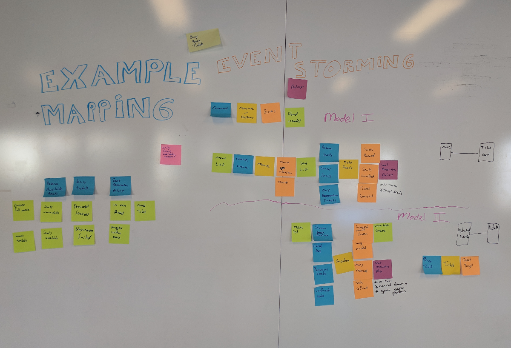
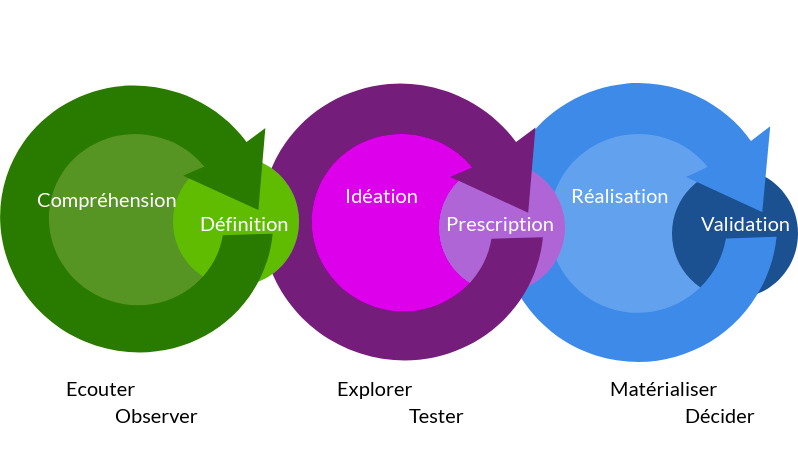

# MAPA CD16

## Description de la prestation

### Méthodologie

L’approche méthodologique liée aux spécificités d’un projet de dématérialisation et d'archivage électronique croise :

- une approche processus : analyse à partir des activités des organisations qui produisent des documents (ou des échanges d’informations), compte tenu de leurs missions dans leur service.

> Notre méthodologie : l'event storming.

Cette méthode nous paraît adaptée au contexte car elle est puissante, engageante, efficiente, simple et amusante.
Elle suppose de pouvoir réunir dans une même pièce les bonnes personnes (celles qui connaissent les questions à poser et celles qui ont les réponses), de fournir un support illimité pour décrire les étapes du processus, d'explorer un domaine par les évènements qui s'y déroulent, et d'identifier les agrégats résultants des événements

- une approche réglementaire : cartographie des textes et réglements en vigueur en prenant en compte la hiérarchie des normes

> Notre méthodologie : le mind mapping

- Une approche outillage logiciel dans le domaine de la gestion électronique de documents, de l’archivage numérique, de la confiance électronique

> Notre méthodologie : détails des ilôts et cartographie ubanisée mis en oeuvre dans des contextes similaires

A partir de ces éléments, receuillis en ateliers, nous établissons avec vous un canvas en nous inspirant de la culture lean afin d'identifier les éléments qui comportent le plus de valeurs d'usages, qu'il soient techniques, réglementaires ou fonctionnels. Cette première identification de la **valeur maximale d'usage** permet de construire un objectif commun et d'identifier la manière dont chacun pourra contribuer à sa réalisation.

En parallèle, des ateliers d'expression du besoin permettent de construire un référentiel commun d'attentes et de commencer à travailler sur leur **priorisation** et l'identification des moyens nécessaires pour leur mise en oeuvre.

Ces ateliers ont également pour objectif de partager un vocabulaire et de mieux comprendre les attentes de chaque partie prenante afin d'établir 2 ou 3 scenarii d'évolution prenant en compte le contexte, les moyens et les objectifs.

**Atelier : Analyse de l'existant**

La mise en place d'ateliers de compréhension des contraintes techniques et des processus documentaires permet d'analyser, de cartographier et de synthétiser les problématiques auxquelles nous devons faire face. Ils consistent à recueillir le savoir des utilisateurs des applications tant d'un point de vue métier que technique.

**Atelier : Expression des besoins**

La mise en place d'ateliers d'expression du besoin permet de construire avec les parties prenantes et notamment les membres du COPROJ et du COPIL une vision commune de la cible à atteindre. Cet atelier est orienté impact et ne vise pas uniquement à construire la cible à atteindre mais également les cibles intermédiaires disposant chacune de leur proposition de valeur pour les futurs usagers.

Par l'identification des [parcours usagers](fiches/parcours-usagers.md), la réalisation d'ateliers de [story mapping](fiches/story-mapping.md) ou l'interview des parties prenantes, nous cherchons à comprendre et à reformuler les besoins exprimés afin de chercher avec vous la meilleure manière d'y répondre.

Nos interventions sont basées sur les **rythmes soutenables** de l'implication des collaborateurs ou collaboratrices.

L’objectif de nos missions de formation et/ou d’accompagnement est de transmettre des connaissances ou des compétences afin de rendre autonome nos client.es. Cette transmision s’effectue tout au long du projet par une interaction, si possible quotidienne avec le référent ou la référente désigné.e par le client ou la cliente. Ces modalités d’échanges visent à garantir l’**implication** des parties prenantes et la **transparence**
de nos activités.
Cette transmission s’effectue également en fin de mission par la transmission de livrables sous licence ouverte, librement modifiables et reproductibles.

### Prestation 1 : Etude de faisabilité de l’extraction des données du SI métiers (RIO + IODAS) et les modalités de transfert des données et dossiers dans un SAE

#### Préambule

A la lecture du CCTP, il ressort que le bon déroulement de la phase 1 de caractérisation de la GED RIO est le pré-requis essentiel au déroulement optimal des phases ultérieures. Aussi, nous vous proposons de considérer cette première phase comme l'élément clé et donc d'y allouer les moyens les plus importants en terme d'accompagnement.

#### Phase 1 - Caractéristiques de la GED RIO et identification de la faisabilité d’extraction des données DJ

L’analyse de la faisabilité de l’extraction des données du SI métier et des modalités de versement doit se faire en lien avec les services producteurs , la direction informatique et le service Archives. L’objectif est de recueillir pour chaque type de dossier métier :  la structuration des données, les exigences archivistiques et métier (durées de conservations et règles d’accès aux dossiers),  les modalités d’extraction puis de transfert des dossiers et métadonnées.  

Pour mener à bien cette prestation nous vous proposons une démarche basée sur  :

* l'analyse du modèle de données par flux et par type de mesure
* l'analyse des points communs entre les différents flux et les différents types de mesure
* l'analyse du niveau de couplage entre le logiciel métier IODAS et la GED RIO
* l'analyse de l'existant et identification des cibles (préparation de la phase 3)
* l'analyse des processus d'alimentation (articulation numérisation, instruction, notification)
* l'identification des dossiers (ouverts / clos) et des propriétés liées au cycle de vie des documents
* l'analyse de la localisation des documents / données (serveurs de fichiers)
* l'analyse du nombre de dossiers par flux
* l'analyse de la volumétrie

Organisation de la prestation  :

* 7 ateliers :
  * 4 ateliers "métier" (1 par flux)
  * 1 atelier DSI (modèle de données et couplage)
  * 1 atelier avec le service Archives
  * 1 atelier avec l'atelier de numérisation
* 6 jours d'études, d'analyses et de formalisation des livrables
* Restitution (1 jour)

Total : 14 jours

#### Phase 2 - Rédaction du profil d’archivage des dossiers de l'aide sociale à l'Enfance (ASE) DJ

Il  convient  de  réaliser  ce  qu’on  peut  appeler  un  modèle conceptuel de données, en transposant la structuration des données du flux ASE dans la logique structurelle du SEDA puis de déterminer les métadonnées adaptées. Il s’agit donc de retranscrire ces informations dans le profil d’archivage, à l’aide de l' outil de génération de profils, SHERPA, mis à disposition par le Service interministériel des Archives de France.

Toutefois, il est important de noter que SHERPA ne permet pas, à ce jour, de créer des profils dans la version 2.1 du SEDA. Par ailleurs, mis à part le logiciel VITAM, aucun SAE existant sur le marché n'accepte cette version du SEDA. Aussi nous recommandons de réaliser dans cette phase deux profils, un en version 1.0 et un second en version 2.0, contrairement à ce qui est demandé dans votre CCTP (p.11).

Par ailleurs, nous estimons qu'il est important que soit associé à cette phase l'ensemble des membres du COPROJ tel que défini dans le CCTP afin de permettre leur parfaite acculturation du SEDA et des enjeux liés à ce schéma. 

Pour mener à bien cette prestation nous vous proposons une démarche alternant formation et réalisations concrètes afin d'autonomiser les chef.fes de projet dans leur futur pratique du SEDA. 

Organisation de la prestation  :

- Formation sur le SEDA et prise en main de l'outil SHERPA (version 1.0 et 2.0),

- Atelier de modélisation du flux : accompagnement dans l'élaboration du mapping et les scénarii possibles de structuration du profil,

- Aide à la rédaction du profil,

- Aide à la rédaction du contrat de service et du contrat de versement.

  Total : 4 jours

#### Phase 3 – Préconisations pour la futur GED sociale en lien avec le SAE (PSOL et MDPH) PR

Lors de cette phase, l'objectif est de mettre en place un entrepôt de données et de documents en capacité de s'interfacer avec la chaîne de numérisation, le logiciel de gestion des procédures de l'action sociale et le futur SAE.

Pour permettre aux parties prenantes (COPIL et COPROJ) de disposer des informations suffisantes pour faire un choix d'outillage, une présentation des points d'attention sera réalisée avec le comité projet. Elle sera enrichie lors de cette présentation des éléments de contexte (budget/ressources humaines) afin de dégager le scenario réalisable.

Objectif : Préconisations pour la future GED sociale en lien avec le SAE (PSOL et MDPH)

Démarche :

* analyse existant : forces et faiblesses de la solution existante.
* présentation modalités d'interface entre systèmes.
  * Protocoles de communication.
  * Modèles de données.
* connecteurs GED SAE. Eléments de gouvernance et offre de service

Points abordés :

* éventail des solutions techniques et logicielles
* cycle de vie et politique d'archivage
* métadonnées de gestion et de pérennisation

Charge de travail :

* 1 atelier MVP  : matrice fonctionnalités/moyens/valeur
* 1 jour rédaction bilan existant
* 1 jours analyse solutions existantes
* 1 jour restitution

Total : 4 jours

#### Phase 4 - Préconisations pour une solution à court terme permettant de sauvegarder les données et métadonnées de la GED RIO dans environnement pérenne garantissant l’intégrité des documents DJ

le  Département  de  la  Charente  procède  depuis  plusieurs  années  à  la numérisation des dossiers d’aide sociale (près de 60 000 dossiers à ce jour). Les dossiers électroniques sont enregistrés et conservés dans un système de GED, en lien avec le système  d’information  métier  IODAS.  Depuis  octobre  2017,  cette  GED  n’est  plus maintenue. Dans ces conditions, il y a une forme d’urgence à mettre en œuvre de manière  opérationnelle  le  versement  de  ces  dossiers  dans  un  SAE,  notamment  des dossiers individuels de l’ASE, compte tenu de leur durée d'utilité administrative et de leur sort final (conservation). Cette mise en sécurité est d’autant plus importante que les dossiers sur support papier ont été éliminés. 

Objectifs : Explorer plusieurs pistes et proposer des  scenarii permettant de garantir la conservation de ces données dans un environnement figé et pérenne le temps d’acquérir le futur SAE du Département en indiquant les avantages et inconvénients pour chaque proposition.

Organisation de la prestation  :

- Analyse des solutions existantes
- Atelier d'expression du besoin avec le COPROJ
  - présentation des solutions envisageables
  - Élaboration de plusieurs scénarii
- Elaboration des synthèses avec :
  - définition du rapport coût/investissement
  - analyse de la charge de travail associée à chaque scenario
- Restitution au COPIL

Total :  4 jours

### Prestation 2 - Solution pour la mise en place d’un archivage électronique mutualisable

#### Phase 5 - Analyse du système d’information du Département dans la perspective d’implémentation d’un SAE PR

Objectif : Analyse du système d’information du Département dans la perspective d’implémentation d’un SAE

Démarche :

* atelier sur les attendus de la mutualisation
* attendus animation interne
* forces : faiblesses solutions externes (coût, souveraineté)

itération :

* présentation des moyens nécessaires à la mise en place d'un SAE
* présentation des moyens nécessaires à la participation à une solution externalisée
* présentation des pré-requis techniques pour l'internalisation
* présentation des besoin de connecteurs

Points abordés :

* forces / faiblesses scenarii
* préconisations urbanisation SI GED / SAE

Charge de travail :

* 1 jour atelier présentation des scenarii DCANT
* 1 jour restitution

total :  2 jours

#### Phase 6 – Définition du périmètre du SAE par rapport à la GED et aux autres applications PR

L'ajout d'un système d'archivage électronique au sein du système d'information est un élément fort de structuration. A la fois élément indispensable des chantiers de dématérialisation et outil de diffusion de l'information contextualisée, il peut dépasser le strict périmètre de la conservation à valeur probante et patrimoniale des documents administratifs pour servir les stratégies d'offres de service de données et de documents.

Celles-ci dépendent toutefois de l'acceptation par les services des processus d'archivage des données associés à la mise en place de l'outillage technique.

La réalisation d'ateliers par flux d'archivage permettra d'aborder ces questions et de définir le périmètre fonctionnel attendu par la mise en place de ce module fonctionnel.

Objectif : Définition du périmètre du SAE par rapport à la GED et aux autres applications.

Démarche :

* établissement de la grille de collecte
* évaluation de la criticité de la production documentaire
* préconisations de priorisation
* un atelier par flux

Points abordés :

1. La cartographie des documents électroniques à archiver
   1. Le social par l’activité des ateliers de numérisation du Pôle Solidarités et de la MDPH  
   2. La chaîne budgétaire et comptable au regard des contraintes de la FULL DEMAT = TOTEM
   3. Les délibérations ainsi que les séances filmées des assemblées plénières (documents audio-visuels) et les arrêtés du Département soumis au contrôle de légalité. 

Charge de travail : 

* 1 jour par flux (x2)
* 1 jour pour la rédaction du rapport d'activité

Total : 3 jours

#### Phase 7 - Scenarii et plan d’action PR

Le plan d'action du Département de la Charent en matière d'offre de service d'archivage dépend en partie de la maturité et des attentes des potentiels "clients" de celle-ci. Il nous paraît opportun de profiter de notre accompnement pour réunir les porteurs de projet d'offre de service d'archivage électronique et les potentiels utilisteurs pour mieux définir les attentes, les besoins et les ressources du Département de la Charente comme coordinateur de cette stratégie.

Nous proposons donc de faire plusieurs itérations permettant successivement de mieux connaître l'offre de service disponible, les attentes de parties prenantes (CD16 et partenaires publics) et les moyens associés à chaque offre de service portée par la collectivité.
|         Axe          | Contenu                                                                                                                                                                                                                                                                                                                                                                                                                                                                                                                                                             |
| :------------------: | :------------------------------------------------------------------------------------------------------------------------------------------------------------------------------------------------------------------------------------------------------------------------------------------------------------------------------------------------------------------------------------------------------------------------------------------------------------------------------------------------------------------------------------------------------------------ |
|       Objectif       | Scenarii et plan d’action                                                                                                                                                                                                                                                                                                                                                                                                                                                                                                                                          |
|       Démarche       | <ul><li>présentation des scenarii</li><li>vision globale (intégration open data, SIA)</li><li>entretien avec les porteurs de projets de solutions externes (publiques)</li><li>interview avec les services internes et collectivités partenaires</li><ul><li>atelier avec les services constitués du territoire et établissements publics</li><li>Atelier sur les enjeux de la mutualisation avec le COPIL</li></ul></ul>                                                                                                                                           |
|    Points abordés    | <ul><li>Description des scénarii préconisés</li><li>Document de synthèse pour comparer les scénarii et identifier les facteurs clefs de la réussite de mise en oeuvre d’un SAE</li><li>Recommandations pour le choix d’un scénario privilégié</li></ul>                                                                                                                                                                                                                                                                                                           |
| détail des livrables | <ul><li>1 jour rédaction des scenario</li><li>3 jours d'ateliers avec les (futurs) utilisateurs et porteurs de projet des offres de mutualisation (CD16, établissements disposant d'un service d'archives, communes et intercommunalités disposant d'un service d'archives constitué)</li><li>1 atelier idéation sur la priorisation de la mise en oeuvre du scenario retenu</li><li>1 jour rédaction rapport de synthèse</li><li>1 jour présentation du rapport de synthèse</li><li>1 jour rédaction préconisation feuille de route et charges associées</li></ul> |
|  charge de travail   | 8 jours                                                                                                                                                                                                                                                                                                                                                                                                                                                                                                                                                             |

## CV

### CV Rhizome data

Domaines de compètences

* GED/SAE
* Gouvernance de l'information
* Gestion des données et open data
* outils de collaboration numériques
* méthodologie agile

Types d'interventions

* Audit, collecte de besoins, rédaction de cahier des charges
* Gestion de projet et pilotage des réalisations côté maîtrise d’ouvrage
* Responsable produit de projets de dématérialisation
* Mise en oeuvre de stratégies de service orientées données
* architecture technique

Quelques références en lien avec le contexte de la mission

* Mise en oeuvre d'une stratégie de GED transverse au département de la Gironde
* Mise en oeuvre d'un atelier de dématérialisation du courrier entrant à la MDPH de Gironde
* Responsable produit SAE Girondin
* Responsable produit portail open data datalocale.fr
