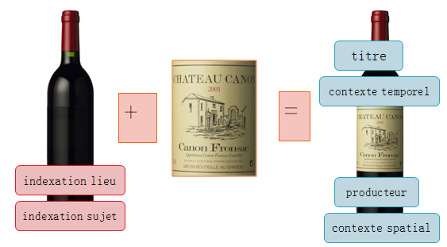

# Standard d'échange de données pour l'archivage - Présentation 

## Les versions du SEDA

- mars 2006, publication de la version 0.1 suivie d'une instruction DITN/RES/2006/001 au 8 mars 2006
- janvier 2010 publication de la version 0.2
- septembre 2012 publication de la version 1.0
- décembre 2015 publication de la version du standard 2.0, conforme à la norme MEDONA 
- juin 2018 publication de la révision 2.1 : Interface web de consultation des schémas de la version 2.1 https://francearchives.fr/seda/api_v2-1/seda-2.1-main.html

---

## Définition 

Le standard d'échange de données pour l'archivage modélise les différentes transactions qui peuvent avoir lieu entre des acteurs dans le cadre de l'archivage de données.  

Il précise les messages échangés ainsi que les métadonnées à utiliser pour décrire, gérer et pérenniser l’information.

---

## Les acteurs du SEDA

Les acteurs sont au nombre de cinq : 

- le service producteur, 
- le service versant, 
- le service d'archives, 
- le service de contrôle, 
- le demandeur d'archives.

Ils peuvent avoir plusieurs rôles en même temps

---

## Les transactions du SEDA

**Les transactions** sont au nombre de six :

- la demande de transfert, 
- le transfert, 
- la modification, 
- l'élimination,
- la communication,
- la restitution. 

---

## Les métadonnées

**définition**

> Une métadonnée est une donnée servant à **définir ou décrire** une autre donnée. **Porteuse d'information** sur le **contexte**, le **sens** et la **finalité** de la ressource informationnelle portée par la **donnée brute**.

------

background-position: top;
background-repeat: no-repeat;
background-image: url(./images/fondCorporate.png)
background-size: contain;

---

Le SEDA utilise quatre sortes de **métadonnées** : 

- Les métadonnées de transport
- Les métadonnées de description,
- Les métadonnées de gestion,
- Les métadonnées techniques.

---

## La structuration des messages 

### La structuration des messages SEDA V1

------

background-position: top;
background-repeat: no-repeat;
background-image: url(./images/fondCorporate.png)
background-size: contain;

### La structuration des messages SEDA V2

------

background-position: top;
background-repeat: no-repeat;
background-image: url(./images/fondCorporate.png)
background-size: contain;

---

---

# Comment le SEDA ?

## Présentation du modèle de données 

Pascal

### Liens avec d'autres modèles de description

Pascal

## Outils de production

### Présentation du Référentiel girondin

Delphine

### Présentation de SHERPA 

Delphine-Pascal

### Comment implémenter le SEDA : Pastel, export des applications métiers

Pascal

## Exercices 

### Profils simples

### Profils plus complexes

