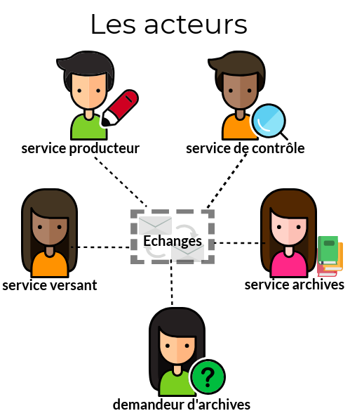
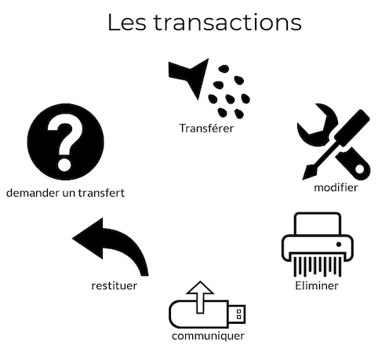
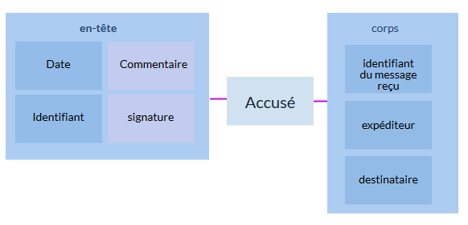
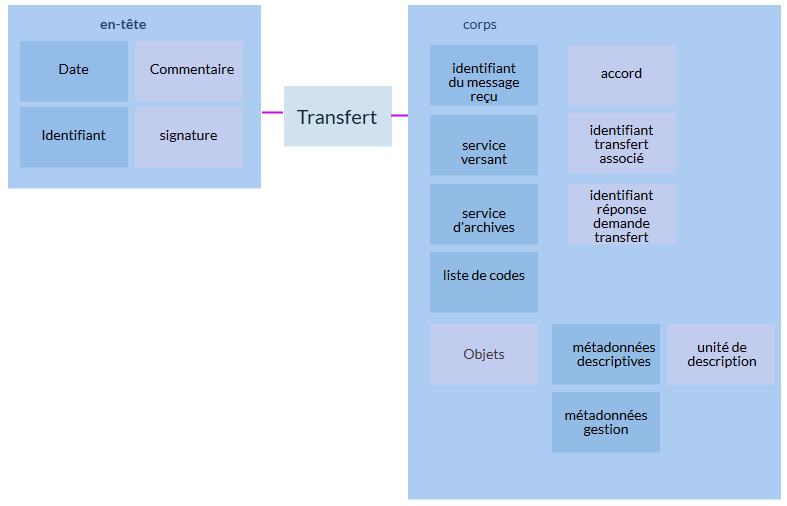
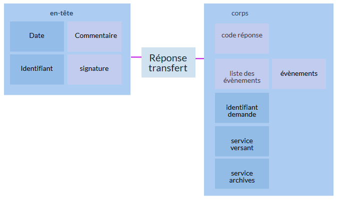
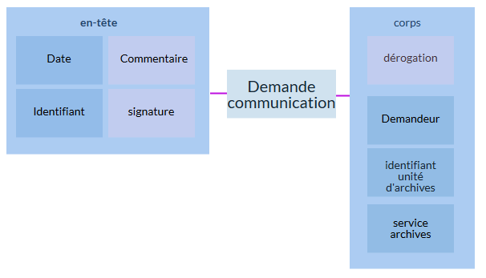
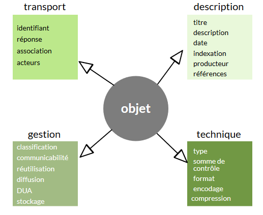
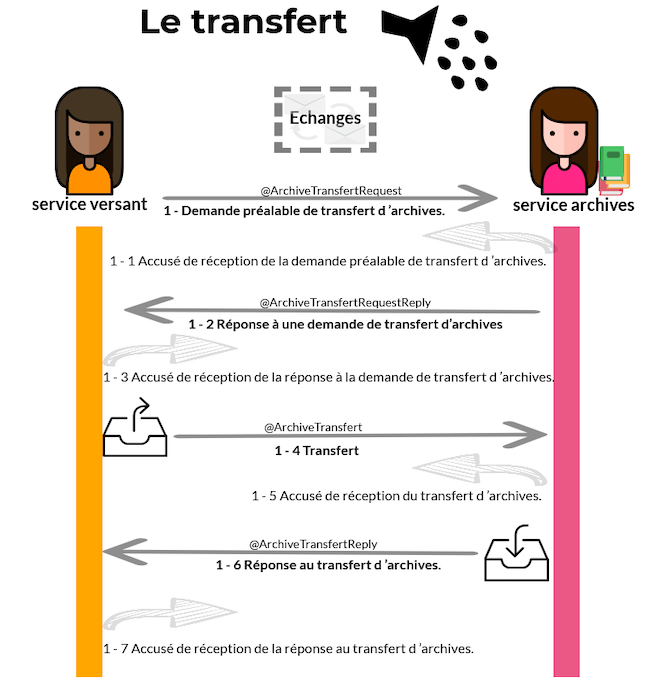
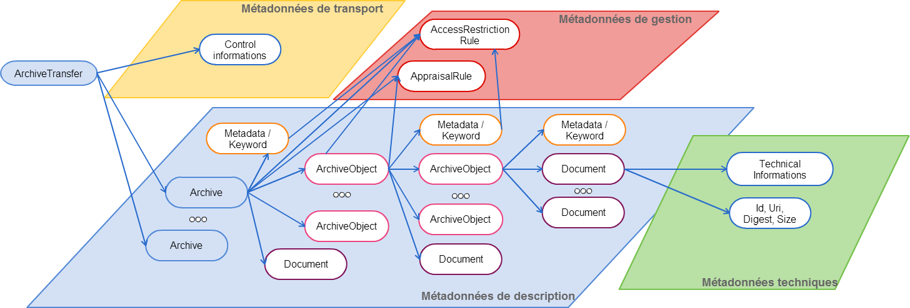
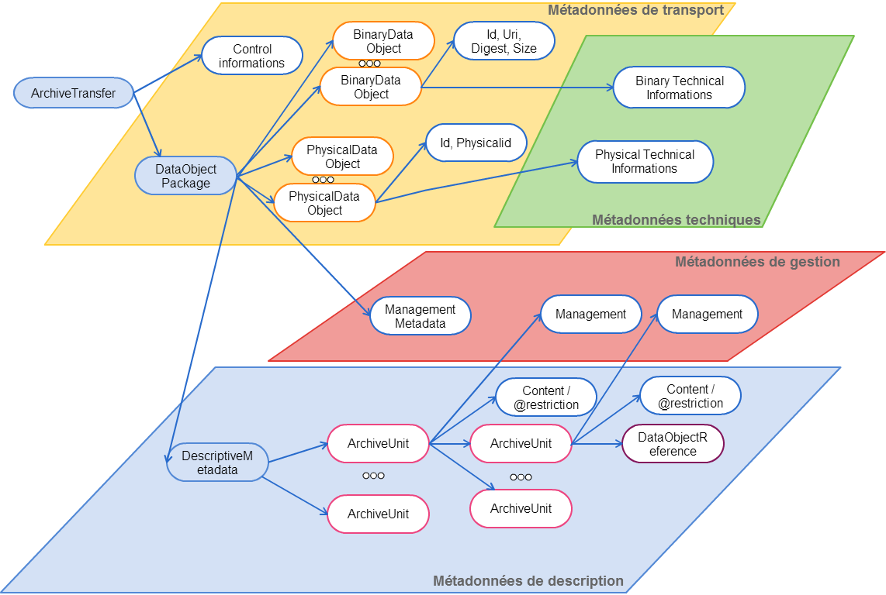

class: left, middle

.footnote[Ceci est fait en texte avec du logiciel libre]

### Standard d'échange de données pour l'archivage (SEDA)

- comprendre la structuration
- comprendre la gestion des métadonnées
- comprendre la notion de profil SEDA, unités d'archives et objets-données
- maîtriser la création de profil SEDA

---

class: left, middle

### Pourquoi le SEDA ?

Faciliter les échanges entre les systèmes d'information en les **normalisant** et en permettant leur **Interopérabilité**.

---

class: left, middle

### Pourquoi le SEDA ?

La rédaction de cette grammaire est à l'initiative du Service interministériel des Archives de France :

- **mars 2006**, publication de la **version 0.1** suivie d'une instruction DITN/RES/2006/001 au 8 mars 2006
- janvier 2010 publication de la version 0.2
- septembre **2012** publication de la **version 1.0**
- **2014** : parution de la norme Afnor **NF 44-022 MEDONA** : Modélisation des échanges de données pour l'archivage
- décembre **2015** publication de la **version du standard 2.0**, conforme à la norme MEDONA
- **2017** : parution de la norme **ISO 20614** : Information et documentation -- Protocole d'échange de données pour l'**interopérabilité et la préservation**
- **juin 2018** publication de la révision 2.1 : Interface web de consultation des schémas de la [**version 2.1**](https://francearchives.fr/seda/api_v2-1/seda-2.1-main.html)

---

class: left, middle

### Pourquoi le SEDA ?

> Le standard d'échange de données pour l'archivage **modélise les différentes transactions** qui peuvent avoir lieu **entre des acteurs** dans le cadre de l'**archivage de données**.

> Il précise les messages échangés ainsi que les métadonnées à utiliser pour **décrire, gérer et pérenniser** l’information.

Il vise à :

- proposer un **cadre d'interopérabilité** pour la dématérialisation des processus d'archivage
- **structurer les messages** renforcant la valeur probante des archives
- **relier des unités de description** au sein du processus de versement

---

class: left, middle

### Les acteurs du SEDA

.pull-left[

]
.pull-right[
Les acteurs sont au nombre de cinq :

- le service producteur,
- le service versant,
- le service d'archives,
- le service de contrôle,
- le demandeur d'archives.

> Ils peuvent avoir plusieurs rôles en même temps
> ]

---

class: left, middle

### Les transactions du SEDA

.pull-left[

]

.pull-right[
**Les transactions** sont au nombre de six :

- la demande de transfert,
- le transfert,
- la modification,
- l'élimination,
- la communication,
- la restitution.

]

---

class: left, middle

### Structurer les messages

.pull-left[

]

.pull-right[

- types d'acteurs
  - service producteur (OriginatingAgency)
  - service versant (TransferingAgency)
  - service d'archives (ArchivalAgency)
  - service de contrôle (AuthorizationControlAuthority)
- représentation
  - messages XML (Request / Reply / Notification / Acknowledgement)
  - schémas de validation (RNG ou XSD)
    ]

---

class: left, middle

### Valeur probante

- le bordereau est l'acte signé du transfert de responsabilité
- les messages d'accusé (répcetion, validation) sont les preuves de la transaction
- les demandes de communication et d'élimination peuvent être signées par un service de contrôle

---

class: left, middle

### Relier des unités de description

.pull-left[

]

.pull-right[

- **encapsuler** dans un bordereau le contenu du versement
- décrire les **acteurs impliqués** (producteur, versant, archives)
- décrire les **propriétés techniques** des objets données
- **décrire le contenu** des unités de description
  ]

---

class: left, middle

### Acquitter / réception

.pull-left[

]

.pull-right[

- dématérialiser le bordereau de versement
- tracer le trasnfert de responsabilité
- décrire les évènements du cycle de vie
  ]

---

class: left, middle

### Faire des demandes

.pull-left[

]

.pull-right[

- Demander une communication, une destruction ou une restitution
- Faire intervenir un service de contrôle
- générer des traces des réponses et des évènements
  ]

---

class: left, middle

### Les métadonnées

**définition**

> Une métadonnée est une donnée servant à **définir ou décrire** une autre donnée. **Porteuse d'information** sur le **contexte**, le **sens** et la **finalité** de la ressource informationnelle portée par la **donnée brute**.

---

class: left, middle

### Typologies de métadonnées

Le SEDA utilise quatre sortes de **métadonnées** :

---

class: left, middle

## Les messages SEDA

Prendre les schémas https://francearchives.fr/seda/documentation.html Interface web de consultation des schémas de la version 2.0 sous forme SVG

https://francearchives.fr/seda/Dictionnaire_SEDA2.1.pdf

---

class: left, middle

### Les messages SEDA

#### Les différents messages lors d'un transfert

---

class: left, middle

### Transfert (@ArchiveTransfert) en SEDA v1

---

class: left, middle

### Transfert (@ArchiveTransfert) en SEDA v2

---

class: left, middle

## Liens avec d'autres schéma de description

- Lien avec l'EAC pour les descripteurs des acteurs
- Lien avec SKOS pour les vocabulaires d'indexation contrôlés
- Lien avec EAD ou RIC pour la description des archives
- Lien avec d'autres schémas (PROV-O, PREMIS, etc) depuis la version 2

---

class: left, middle

# Comment le SEDA ?

Pour produire les fichiers xml nécessaire aux processus ou à la modélisation des paquets d'information, plusieurs outils sont disponibles :

- éditeur xml : production de bordereaux de versement ou de profils
- SHERPA : application en ligne de génération de profils
- SAEM : application en ligne de génération de profils et de génération de bordereaux SEDA

---

class: left, middle

## Outils de production

---

class: left, middle

### Présentation de SHERPA

Delphine-Pascal

---

class: left, middle

### Présentation du Référentiel girondin

Les différences :

- Créations de vocabulaires contrôlés
- Des notices producteurs plus complètes

---

class: left, middle

### Comment implémenter le SEDA : Pastel, export des applications métiers

Pascal

---

class: left, middle

## Exercices

---

class: left, middle

### Profils simples

- La matrice cadatrale selon SIAF
- Les vidéo des séances d'une collectivité territoriale

---

class: left, middle

### Profils plus complexes

- La matrice cadastrale dans la réalité
- Les marchés publics
- Bureautique : Activités d'Olkoa en 2018
- tous les marchés de travaux de 2018
