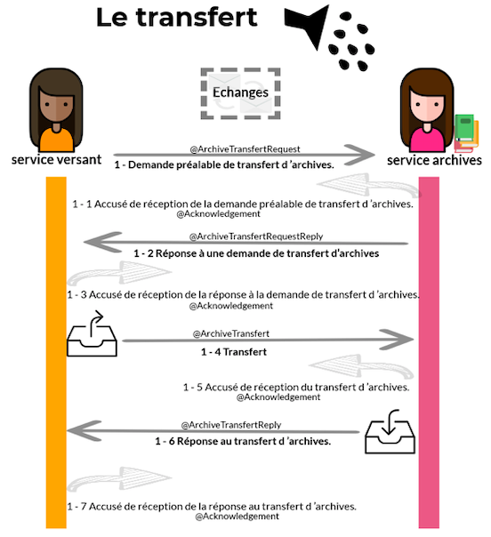
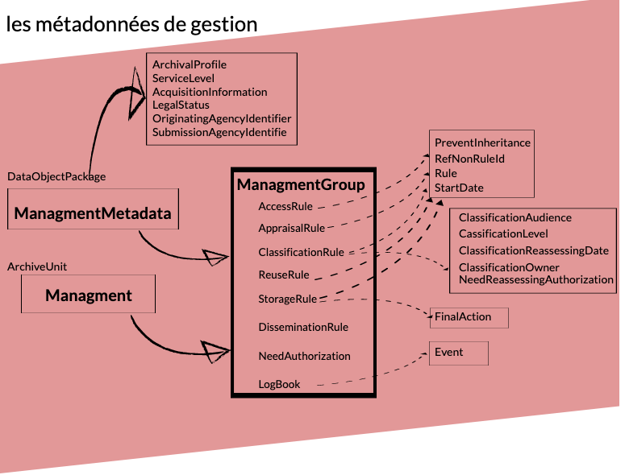
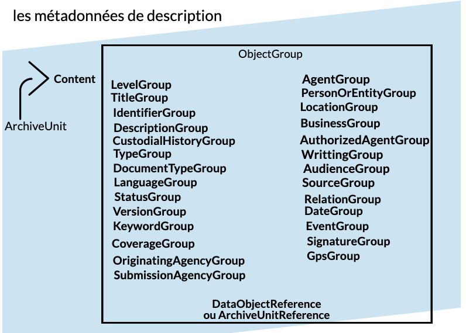

class: left, middle

.footnote[Ceci est fait en texte avec du logiciel libre]

### Standard d'échange de données pour l'archivage (SEDA)

- comprendre la structuration
- comprendre la gestion des métadonnées
- comprendre la notion de profil SEDA, unités d'archives et objets-données
- maîtriser la création de profil SEDA

---

class: left, top

### Pourquoi le SEDA ?

Faciliter les échanges entre les systèmes d'information en les **normalisant** et en permettant leur **interopérabilité**.

.reduite[]

---

class: left, top

### Pourquoi le SEDA ?

La rédaction de cette grammaire est à l'initiative du Service interministériel des Archives de France :

- **mars 2006**, publication de la **version 0.1** suivie d'une instruction DITN/RES/2006/001 au 8 mars 2006
- janvier 2010 publication de la version 0.2
- septembre **2012** publication de la **version 1.0**
- **2014** : parution de la norme Afnor **NF 44-022 MEDONA** : Modélisation des échanges de données pour l'archivage
- décembre **2015** publication de la **version du standard 2.0**, conforme à la norme MEDONA
- **2017** : parution de la norme **ISO 20614 DEPIP** : Information et documentation -- Protocole d'échange de données pour l'**interopérabilité et la préservation**
- **juin 2018** publication de la révision 2.1 : Interface web de consultation des schémas de la [**version 2.1**](https://francearchives.fr/seda/api_v2-1/seda-2.1-main.html)

---

class: left, top

### Pourquoi le SEDA ?

> Le standard d'échange de données pour l'archivage **modélise les différentes transactions** qui peuvent avoir lieu **entre des acteurs** dans le cadre de l'**archivage de données**.

> Il précise les messages échangés ainsi que les métadonnées à utiliser pour **décrire, gérer et pérenniser** l’information.

---

class: left, top

### Pourquoi le SEDA ?

Il vise à :

- proposer un **cadre d'interopérabilité** pour la dématérialisation des processus d'archivage
- **structurer les messages** renforcant la valeur probante des archives
- **relier des unités de description** au sein du processus de versement

---

class: left, top

### Les acteurs du SEDA

.pull-left[

]
.pull-right[
Les acteurs sont au nombre de cinq :

- le service producteur,
- le service versant,
- le service d'archives,
- le service de contrôle,
- le demandeur d'archives.

> Ils peuvent avoir plusieurs rôles en même temps
> ]

---

class: left, top

### Les transactions du SEDA

.pull-left[

]

.pull-right[
**Les transactions** sont au nombre de six :

- la demande de transfert,
- le transfert,
- la modification,
- l'élimination,
- la communication,
- la restitution.

]

---

class: left, top

### Structurer les messages

.pull-left[

]

.pull-right[

- types d'acteurs
  - service producteur (OriginatingAgency)
  - service versant (TransferingAgency)
  - service d'archives (ArchivalAgency)
  - service de contrôle (AuthorizationControlAuthority)
- représentation
  - messages XML (Request / Reply / Notification / Acknowledgement)
  - schémas de validation (RNG ou XSD)
    ]

---

class: middle, top

### Les messages SEDA

#### Les types de messages lors d'un transfert

.reduite[]

---

class: left, top

#### Les types de messages lors d'une communication

---

class: left, top

#### Les types de messages lors d'une modification

---

class: left, top

#### Les types de messages lorsd'une élimination

---

class: left, top

#### Les types de messages lors d'une restitution

---

class: left, top

#### Les demandes d'autorisation

##### Les types de messages lors d'une demande d'autorisation au service producteur

---

class: left, top

##### Les différents messages lors d'une demande d'autorisation au service de contrôle

---

#### Renforcer la valeur probante des échanges

- le bordereau est l'acte "signé" du **transfert de responsabilité**
- les messages d'accusé (réception, validation) sont les **preuves** de la transaction
- les demandes de communication et d'élimination peuvent être signées par un **service de contrôle**

---

class: left, top

##### Transférer : la structuration des messages

.pull-left[

]

.pull-right[

- **encapsuler** dans un bordereau le contenu du versement
- décrire les **acteurs impliqués** (producteur, versant, archives)
- décrire les **propriétés techniques** des objets données
- **décrire le contenu** des unités de description
  ]

---

class: left, top

##### Acquitter / réceptionner : la structuration des messages

.pull-left[

]

.pull-right[

- dématérialiser le bordereau de versement
- tracer le trasnfert de responsabilité
- décrire les évènements du cycle de vie
  ]

---

class: left, top

##### Demander : la structuration des messages

.pull-left[

]

.pull-right[

- Demander une communication, une destruction ou une restitution
- Faire intervenir un service de contrôle
- générer des traces des réponses et des évènements
  ]

---

class: left, top

### Les différérences entre le SEDA v1 et le SEDA v2

Une structuration **arborescente** versus une structuration orientée **données** 

SEDA v1 : modèle hérité de la norme de description ISAD(G) et de la DTD EAD.

SEDA v2 : modèle aligné sur les normes de description orientées ressources (RDA, FFBR, RIC)

---

class: left, top

#### Transfert (@ArchiveTransfert) en SEDA v1

---

class: left, top

#### Transfert (@ArchiveTransfert) en SEDA v2

---

class: left, top

### Structure d'un profil (SEDA v2)

#### Les éléments obligatoires du transfert

---

class: left, top

### Les métadonnées

**définition**

> Une métadonnée est une donnée servant à **définir ou décrire** une autre donnée. **Porteuse d'information** sur le **contexte**, le **sens** et la **finalité** de la ressource informationnelle portée par la **donnée brute**.

---

class: left, top

### Typologies de métadonnées

Le SEDA utilise quatre sortes de **métadonnées** :

---

class: left, top

#### Les métadonnées de transport

Les   métadonnées   de   transport   ont   pour   objet   d’encadrer   le   transport   des   Objets   de   données   depuis l’opérateur de versement jusqu’au service d’archives.

???
empreinte des fichiers, inventaires des Objets de données transmis, identité de l’émetteur et du récepteur,
contrat applicable aux Objets de données transférés
Ces   métadonnées   constituent   un   bloc   à   part   entière   sous   une   forme   de   liste,   pour   tous   les éléments concernés par le transport.  Elles sont uniques par objet d’archives ou par lot d’archives.

Référence à l’accord de service (Archival Agreement)
 le choix des référentiels et des modèles à utiliser lors des transactions
  la liste des acteurs, leurs rôles et responsabilités dans ces transactions
  les niveaux de service, les règles d’accessibilité et les règles de sort final
Liste des objets de données

---

class: left, top

#### Les métadonnées de gestion

Les métadonnées de gestion ont pour objet de rassembler l'ensemble des informations utiles à la gestion dans le temps de l'objet archivé : durées de conservation, règles d'accès, 

Ces métadonnées peuvent être communes à tous les objets transférés ou spécifiques à chacun d'entre eux.

.reduite[

]

???
AccessRule = Gestion de la communicabilité = Bloc    de    métadonnées    de    gestion    permettant    de    gérer    la communicabilité.   Utilisable   dans   la   zone   des   métadonnées   de gestion  du  paquet  d’Objet   de   données et   dans   la   zone   des métadonnées de description, dans les niveaux de description.

PreventInheritance= Gestion  de  l’héritage  dans  le  nœud courant==> Métadonnée permettant d’ignorer toutes les règles de gestion héritées des nœuds parents dans le nœud courant.

RefNonRuleId= Arrêt de l’héritage dans le nœud courant==>Métadonnée permettant de retirer de l’héritage une règle de gestion définie dans le nœud courant.

Rule = Règle de gestion de la communicabilité ==> Référence  à  une  règle  de  communicabilité  à  appliquer.  Cette  dernière est  présente  dans  un  référentiel  sur  lequel  les  différents  acteurs  de l’échange se sont mis d’accord.

StartDate = Date de départ du calcul ==> Date permettant de calculer le terme de l’application de la règle de gestion  définie  dans  le  bloc  de  métadonnée  de  gestion  permettant  de gérer la communicabilité.

------

class: left, top

#### Les métadonnées techniques

???
informations de représentation, informations d’intégrité et informations d’identification

---

class: left, top

#### Les métadonnées de description

Les Métadonnées descriptives regroupent l'ensemble des informations descriptives des objets de données. Les informations de pérennisation font référence aux objets de données listés et décrits dans le BinaryDataObjectType et le PhysicalDataObjectType.

???

archiveUnit : Information   qui   permet   de   gérer   à   la   fois   la hiérarchie intellectuelle, tout en contenant les métadonnées de description    et    de    gestion    propres    à    chaque    niveau    de description  archivistique.

---

class: left, top

### Liens avec d'autres schéma de description

---

class: left, top

### Comment le SEDA ?

Pour produire les fichiers xml nécessaire aux processus ou à la modélisation des paquets d'information, plusieurs outils sont disponibles :

- éditeur xml : production de bordereaux de versement ou de profils
- SHERPA : application en ligne de génération de profils
- SAEM : application en ligne de génération de profils et de génération de bordereaux SEDA

.reduite2[]
.reduite2[]
.reduite2[]

---

class: left, top

### Présentation de SHERPA

SHERPA a été conçu pour remplacer AGAPE et fournir un lieu centralisé de production de profils SEDA. Il implémente l'ensemble des champs du SEDA 2.0 et permet d'exporter des profils pour les intégrer dans d'autres outils. Il permet de choisir parmi une liste définie de vocabulaires les listes de codes associés aux profils.

.reduite[]

---

class: left, top

### Présentation de SHERPA : Accueil

---

class: left, top

### Présentation de SHERPA : Création de notice d'autorité

---

class: left, top

### Présentation de SHERPA : Création d'unité d'archives

---

class: left, top

### Présentation de SHERPA : Création de profil

---

class: left, top

### La brique logiciel « Le référentiel girondin » : clé de voute du système

- Objectif : réalisation d’un référentiel de structuration et de gestion des métadonnées, interopérable, développé en open source, prenant en compte le contexte normatif et basé sur une ontologie pour :
- Créer, importer, centraliser, gérer et exposer :
  - des autorités et unités administratives
  - des vocabulaires contrôlés externes ou internes
  - des notices d’autorité des acteurs de l’archivage
  - des profils d’archivage conformes au SEDA (toutes versions)
  - des identifiants pérennes : numéroteur centralisé du système d’archivage électronique

---

class: left, top

### La brique logiciel « Le référentiel girondin » : les différences avec SHERPA

.reduite[]

???
Le module référentiel permet de :

- créer des autorités et unités administratives
- créer, importer et exporter des vocabulaires contrôlés
- créer, importer et exporter des notices producteurs plus complètes
- Générer des identifiants ARK

---

class: left, top

### La brique logiciel « Le référentiel girondin » : les autorités et unités administratives

**Entités Autorités administratives** **et unités administratives** : possibilité de créer des autorités administratives, des unités administratives et agents administratifs liés : gestion de la fluctuation des organigrammes, gestion des droits, paramétrages des autres briques du SAE.

.reduite[]

---

class: left, top

### La brique logiciel « Le référentiel girondin » : création de vocabulaires contrôlés

Les vocabulaires sont des **listes de termes** organisées. Ils peuvent prendre la forme de listes simples (listes d’autorité) ou hiérarchiques (thésaurus).

**Entités vocabulaires contrôlés** : possibilité d’importer et d'exporter des vocabulaires au format SKOS (thésaurus et listes d’autorité du SIAF) et au format CSV (sort final, communicabilité, DUA, etc.), et d’en créer en fonction des besoins métiers de chaque collectivité (ex : liste des lieux ou bâtiments gérés). Ces vocabulaires réunissent des métadonnées descriptives et de gestion.

---

class: left, top

### La brique logiciel « Le référentiel girondin » : création de vocabulaires contrôlés

.pull-left[

]

.pull-right[

]

---

class: left, top

### La brique logiciel « Le référentiel girondin » : créer des notices producteurs

**Entité notices producteur** : possibilité de créer, d’importer et d'exporter des notices d’autorité (conformément à la norme ISAAR-CPF et suivant le format XML-EAC).

.pull-left[

]

.pull-right[

5 onglets :

- informations générales
- description
- propriétés
- relations
- cycle de vie

]

---

class: left, top

### La brique logiciel « Le référentiel girondin » : créer des notices producteurs

Focus sur l'onglet description :

.pull-left[

].pull-right[

Ajouter les champs souhaités :

]

---

class: left, top

### La brique logiciel « Le référentiel girondin » : les identifiants ARK

le modèle d’attribution des identifiants au sein du SAE girondin

.reduite[]

---

class: left, top

### La brique logiciel « Le référentiel girondin » : les identifiants ARK

.pull-left[ le modèle d’attribution des identifiants au sein du SAE girondin

]

.pull-right[

Structure et intégrité des identifiants ARK dans le SAE girondin :

- permet de relier les données entre elles via des liens et **des identifiants** en supprimant les ambigüités.
- permet de fournir à des briques logicielles externes des identifiants pérennes via le protocole **OAI-PMH**
  ]

---

class: left, top

### Structure des identifiants

- Les parties **Name et qualifier** sont construites sous la forme d’une chaine de caractères aléatoires avec les contraintes suivantes :
- une chaîne de caractères alphanumériques avec **une séquence en base 2**9 : uniquement des consonnes (sauf l) et des chiffres 0 à 9
- la partie Name commence par un préfixe « _rf_ » **fixant le contexte d’attribution des identifiants**
- une longueur fixe de **10 caractères**

---

class: left, top

### Comment implémenter le SEDA : Pastel, export des applications métiers

---

class: left, top

## Exercices

---

class: left, top

### Profils simples

- La matrice cadatrale selon SIAF : création d'un profil à partir de la documentation du SIAF
- Les vidéo des séances d'une collectivité territoriale

---

class: left, top

### Profils plus complexes

- La matrice cadastrale dans la réalité : réflexion autour du profil fourni par le SIAF et comment l'améliorer grâce notamment au SEDA V2.

  - les types de fichiers

  - les dates des fichiers

  - renseigner des communicabilités différentes au sein des UA

* Les marchés publics

* Bureautique : Activités d'Olkoa en 2018

---

class: left, top

## Bibliographie

Prendre les schémas https://francearchives.fr/seda/documentation.html Interface web de consultation des schémas de la version 2.0 sous forme SVG

https://francearchives.fr/seda/Dictionnaire_SEDA2.1.pdf
