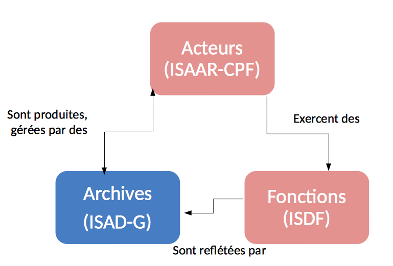
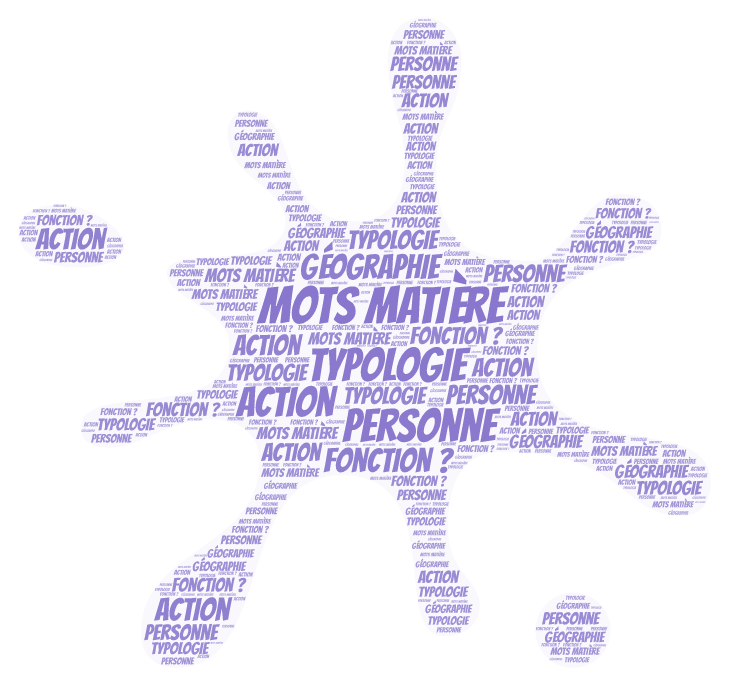
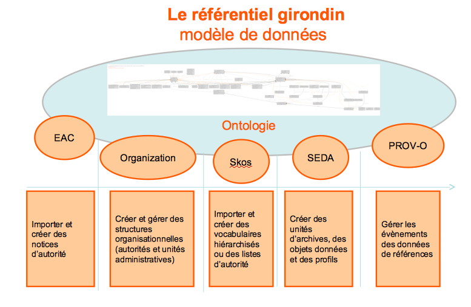

class: inverse, center, middle
background-image: url(./images/continuum.jpg)
background-position: top;
background-repeat: no-repeat;
background-size: contain;
.footnote[Ceci est fait en texte avec du logiciel libre]

# Formation Référentiel : notices d'autorité

---

## Objectifs

- comprendre la gestion des données de référence
- comprendre la notion de notices d'autorité
- maîtriser la création de notices

---

## Présentation : 20"

Objectifs : faire un tour de table, ouverture des échanges (pas de mauvaises questions, loi des 2 pieds, détente collective)

- pourquoi nous sommes là ?
- quel est notre objectif commun ?

**Dispositif** :

_-_ Nuage de mots : https://answergarden.ch/create/

---

## Programme de la formation : 5"

- matinée : concepts et usages
- après-midi : manipulation (les mains dans le cambouis)

---

### Concept : les données de référence de l'archivage

#### Les normes appliquées aux archives : 10"

Des descriptions séparées mais liées permettent :

- De traiter de manière très efficace les relations complexes et multidimensionnelles
- D’améliorer la communication et l’échange d’informations archivistiques
- L’interopérabilité entre les systèmes d’information

> contextualisation : la mise en place du standard RIC montre l'évolution de la pratique archivistique en lien avec l'exposition des archives sur le Web

#### **L'indexation**

---

### Présentation du référentiel : 30"

##### 1. Objectif d'un référentiel de données : 10"

**RAPPEL** :

La mise à disposition de « _données de référence_ » constitue depuis de la loi « Lemaire » sur la République numérique du 7 octobre 2016, « _une mission de service public relevant de l'État_ » (article 14).

Toutes les administrations sont censées participer à ce « service public de la donnée » : ministères, collectivités territoriales, opérateurs publics, etc.

---

**Un outil « #DataQuality »**

**Objectif** : Un référentiel de structuration et de gestion des métadonnées, interopérable, développé en open source, prenant en compte le contexte normatif et basé sur une ontologie.

> Ontologie : décrit un champ de connaissances ou répond à des objectifs particuliers (modéliser les objets et leurs parties)

---

Un référentiel de structuration et de gestion des métadonnées, interopérable pour **créer, importer, centraliser, gérer et exposer** :

\*des vocabulaires contrôlés publics ou internes

- des notices d’autorité des acteurs de l’archivage
- des autorités et unités administratives
- des profils d’archivage conformes au SEDA (toutes versions)

---

#### 2. Les entités dans le référentiel

##### les vocabulaires contôlés 5"

Les vocabulaires sont des **listes de termes** organisées. Ils peuvent prendre la forme de listes simples (listes d’autorité) ou hiérarchiques (thésaurus).

Dans le référentiel, il est possible de créer des vocabulaires mais également d’en importer.

---

#### 2. Les entités dans le référentiel

###### les producteurs 5"

Les notices d’autorités sont des **fiches de description des producteurs** d’archives, conformément à la norme [ISAAR-CPF](https://fr.wikipedia.org/wiki/Norme_internationale_sur_les_notices_d%27autorit%C3%A9_archivistiques_relatives_aux_collectivit%C3%A9s,_aux_personnes_et_aux_familles). Le référentiel implémente le schéma [EAC-CPF](http://eac.staatsbibliothek-berlin.de/) et permet ainsi d’importer, de créer et d’exporter des notices d’autorités dans un **format intéropérable** (XML) avec d’autres applications.

Dans le référentiel, chaque notice d’autorité présente des informations sur un producteur qui sont classée dans les quatre premiers onglets (informations générales, description, propriétés, relations). Ces onglets correspondent aux zones de la norme ISAAR-CPF. Un cinquième onglet « cycle de vie » correspond à l’enregistrement des évenements effectués sur la notice.

---

#### 2. Les entités dans le référentiel

##### Les autorités administratives 5"

Au sein du référentiel, une **autorité administrative** est une collectivité (commune, département ou un établissement public) « mère », composée de plusieurs **unités administratives** « filles » (directions ou services) et de x **agents** de type personne (employés).

L’autorité administrative n’a pas de rôle archivistique propre ; les rôles sont définis pour les unités. Par contre elle permet de paramétrer le NAAN du système d'identifiant des entités ARK.

> NAAN : Name Assigning Authority Number . L'identifiant d'autorité d'une entité (administrative)

---

#### 2. Les entités dans le référentiel

##### Les profils 5"

Pour préparer des versements automatisés ou réguliers d’archives électroniques, l’étude du flux permet de définir un plan de classement type, ainsi que le contenu attendu et des règles de gestion (DUA, sort final ou communicabilité).

L’ensemble des règles définies constitue un profil SEDA, lui-même composé de plusieurs unités d’archives et d’objets données associés. Dans un premier temps, il convient de créer des unités d’archives qui seront réutilisables dans n’importe quel profil.

---

## PAUSE : 20"

---

### III - Les notices producteurs dans le Référentiel : 85"

#### présentation de la norme ISAAR-CPF : les éléments obligatoires : 10"

##### lien entre les entités du référentiel : 10"

1. lien avec les vocabulaires : 2"
2. lien avec les autorités administratives : 2"
3. lien avec les profils SEDA : 1"
4. lien avec les outils de gestion des archives papier et électroniques : 5"
5. workflow de publication
6. Synchronisation

##### Présentation de l'interface de saisie en détails : 45"

##### Le schéma EAC (évolution vers RIC) : 20"

---

## Main dans le cambouis

### Créer une notice

#### Saisie de la zone information générale

---

#### Saisie de la zone information générale

**Exercice** :

- Renseigner la zone description
- Ajouter les 8 zones de description
- Renseigner la zone propiété
- Renseigner la zone relation
- Publier
- Exporter en EAC

---

faire refaire un tableau célèbre par superposition
