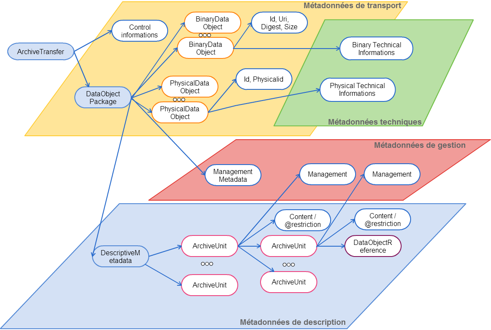

class: center, middle

background-position: top;
background-repeat: no-repeat;
background-image: url(./images/fondCorporate.png)
background-size: contain;
.footnote[Ceci est fait en texte avec du logiciel libre]

### Objectifs

- comprendre la gestion des données de référence
- comprendre la notion de profil SEDA, unités d'archives et objets-données
- maîtriser la création de profil SEDA

---
background-position: top;
background-repeat: no-repeat;
background-image: url(./images/fondCorporate.png)
background-size: contain;

### Présentation

Objectifs : faire un tour de table, ouverture des échanges (pas de mauvaises questions, loi des 2 pieds, détente collective)

- pourquoi nous sommes là ?
- quel est notre objectif commun ?

**Dispositif** :

Nuage de mots : https://answergarden.ch/create/

---
background-position: top;
background-repeat: no-repeat;
background-image: url(./images/fondCorporate.png)
background-size: contain;

### Programme de la formation : 5"

- matinée : concepts et usages
  - processus et versement
  - métadonnées et structuration
  - SEDA : modèle de données
  - présentation de l'interface du référentiel
- après-midi : manipulation (les mains dans le cambouis)

---
background-position: top;
background-repeat: no-repeat;
background-image: url(./images/fondCorporate.png)
background-size: contain;

### Introduction sur processus de versement

#### Un petit détour par la vision processus

> **processus** : ensemble ordonnées d'activités qui délivre un produit et/ou un service, à un "client" interne ou externe, lui apporte de la valeur, répond à ses besoins exprimés ou implicites et nécessite d'être maîtrisé/piloté

> **processus métier** : ensemble des activités qui s’enchaînent pour créer un produit ou un service à partir d’éléments de base. Un processus se décompose en sous-processus. (MAC, glossaire de l'archivage)

---
background-position: top;
background-repeat: no-repeat;
background-image: url(./images/fondCorporate.png)
background-size: contain;

#### Modélisation d'un processus

On commence par définir les diagrammes de cas d'utilisation (Use Case)

<!--
Qui permettent de donner une vue globale de l'application. Pas seulement pour un client non avisé qui aura l'idée de sa future application mais aussi le développeur s'en sert pour le développement des interfaces.

La représentation d'un cas d'utilisation met en jeu trois concepts : l'acteur, le cas d'utilisation et l'interaction entre l'acteur et le cas d'utilisation.

Cas d'utilisation : Un cas d'utilisation (use case) représente un ensemble de séquences d'actions qui sont réalisées par le système et qui produisent un résultat observable intéressant pour un acteur particulier

-->

---
background-position: top;
background-repeat: no-repeat;
background-image: url(./images/fondCorporate.png)
background-size: contain;

#### Modélisation d'un processus

Ensuite on va présenter la chronologie des opérations par les diagrammes de séquences.

---
background-position: top;
background-repeat: no-repeat;
background-image: url(./images/fondCorporate.png)
background-size: contain;

#### Modélisation d'un processus

Et finir par les diagrammes statiques, qui sont celles de classe de conception, de classe participantes et le modèle physique.

---

#### Les métadonnées de pérennisation

---
background-position: top;
background-repeat: no-repeat;
background-image: url(./images/fondCorporate.png)
background-size: contain;

#### Introduction sur les Métadonnées en général

**définition**

> Une métadonnée est une donnée servant à **définir ou décrire** une autre donnée. **Porteuse d'information** sur le **contexte**, le **sens** et la **finalité** de la ressource informationnelle portée par la **donnée brute**.

---
background-position: top;
background-repeat: no-repeat;
background-image: url(./images/fondCorporate.png)
background-size: contain;

#### Le standard des échanges d'archives publiques : SEDA

.pull-left[

]
.pull-right[

- Le schéma SEDA permet de décrire les relations entre les acteurs au cours des échanges (transfert, de communication, de modification, d'élimination ou de restitution d’archives).

- Il permet d'automatiser les procédures d'échange d'information en décrivant les règles contractuelles qui régissent le versement et la prise en charge d'un paquet d'information.

- Les messages SEDA décrivent les contraintes (format, support, identification) et fournissent un historique des opérations effectuées (transfert, réception, destruction, etc..)

- La grammaire XML permet de définir des règles formelles vérifiables par les machines (est égal à, ne peut pas être différent de, n'existe qu'en un seul exemplaire, provient de, etc...)
  ]

---
background-position: top;
background-repeat: no-repeat;
background-image: url(./images/fondCorporate.png)
background-size: contain;

#### modélisation des échanges d’informations dans le cadre de l’archivage

- les acteurs de l'échange
  - service producteur
  - service versant
  - service d'archives
  - service de contrôle
  - service demandeur

.reduite[

]

---
background-position: top;
background-repeat: no-repeat;
background-image: url(./images/fondCorporate.png)
background-size: contain;

#### La structuration des données
* Archive : Elle est composée de métadonnées (informations de représentation et de pérennisation) ainsi que d'objets d'archives et de documents.
* Objet d'archives: Il s'agit d'une subdivision intellectuelle de l'Archive qui possède des caractéristiques propre de conservation. Les objets peuvent eux-même subdivisés
en objets.
* Document: Sert à transporter des contenus de données (fichiers) associés à leurs métadonnées.

---
#### La structuration des messages SEDA

---
background-position: top;
background-repeat: no-repeat;
background-image: url(./images/fondCorporate.png)
background-size: contain;

### La structuration des messages SEDA

---
background-position: top;
background-repeat: no-repeat;
background-image: url(./images/fondCorporate.png)
background-size: contain;

#### Transfert d'archives en SEDA

---
background-position: top;
background-repeat: no-repeat;
background-image: url(./images/fondCorporate.png)
background-size: contain;

#### Transfert d'archives en SEDA

---
background-position: top;
background-repeat: no-repeat;
background-image: url(./images/fondCorporate.png)
background-size: contain;

#### transfert de marchés notifiés en SEDA : la production

---
background-position: top;
background-repeat: no-repeat;
background-image: url(./images/fondCorporate.png)
background-size: contain;

#### transfert de marchés notifiés en SEDA : l'arborescence d'un versement

---

background-position: top;
background-repeat: no-repeat;
background-image: url(./images/fondCorporate.png)
background-size: contain;

### Le référentiel et les profils SEDA : Ce qu'il faut comprendre

Pour préparer des versements automatisés ou réguliers d’archives électroniques, l’étude du flux permet de définir un plan de classement type, ainsi que le contenu attendu et des règles de gestion (DUA, sort final ou communicabilité). L’ensemble des règles définies constitue un profil SEDA, lui-même composé de plusieurs unités d’archives et d’objets données associés. Dans un premier temps, il convient de créer des unités d’archives qui seront réutilisables dans n’importe quel profil.

---

background-position: top;
background-repeat: no-repeat;
background-image: url(./images/fondCorporate.png)
background-size: contain;

#### Les unités d'archives

Les unités d'archives (UA) sont les éléments clés qui vont nous permettre de réaliser un profil SEDA

Le référentiel est un outil de gestion des données de référence, le but est de créer ces données de référence qui pourront par la suite être réutilisables à volonté.

==> une unité d'archives pourra être réutilisée dans plusieurs profils SEDA différents.

==> On peut créer une UA pour n’importe quel niveau de  description (dossier, sous-dossier, pièce, collection, etc.). Le niveau de description constitue l’un des champs obligatoires.

---

background-position: top;
background-repeat: no-repeat;
background-image: url(./images/fondCorporate.png)
background-size: contain;

#### Créer une unité d'archives

Cliquer sur l’icône **+** pour créer l’UA

##### Onglet informations générales / description

- Le premier pavé « aide à la saisie » correspond au nom de cette UA **<u>dans le référentiel</u>**.
- Renseigner l’autorité nommante ark.
- Renseigner les champs nécessaires. Ceux marqués d’un carré rouge sont obligatoires.
- Le champ titre apparaîtra dans la ged sas. Pour le renseigner, **<u>2 cas de figures</u>** se présentent 

---

background-position: top;
background-repeat: no-repeat;
background-image: url(./images/fondCorporate.png)
background-size: contain;

##### Focus sur le Champ titre d'une UA

1. <u>Le titre est fixé à l’avance</u>, il peut donc être renseigné dans le  champ valeur et ne sera pas modifiable par le service versant lors de la  préparation d’un versement.

   

2. <u>Le titre sera renseigné par le service versant lors de la  préparation d’un versement</u>, il faut donc laisser le champ valeur vide et  actionner l’aide à la saisie (en cliquant sur **+**) afin de préciser les  éléments attendus.

---

background-position: top;
background-repeat: no-repeat;
background-image: url(./images/fondCorporate.png)
background-size: contain;

Tous les champs ne sont pas obligatoires pour les faire apparaitre au moment du versement il faut :

- Ouvrir les champs que l’on souhaite faire renseigner lors de la préparation du versement (ex : date de début, date de fin)
- Il est recommandé de renseigner « la langue de contenu » dès la  conception de l’UA. Cliquer sur le **+** puis sur « Relier à concept ». Dans  la zone de recherche, saisir « french » (ou une autre valeur si  besoin), cocher ce concept et valider.

---

background-position: top;
background-repeat: no-repeat;
background-image: url(./images/fondCorporate.png)
background-size: contain;

##### Valider = Mon UA est créée 

---

background-position: top;
background-repeat: no-repeat;
background-image: url(./images/fondCorporate.png)
background-size: contain;

##### Onglet gestion

Cet onglet permet de renseigner les DUA, sort final et délais de  communicabilité. Faire glisser la souris et cliquer sur le + vert.

---

background-position: top;
background-repeat: no-repeat;
background-image: url(./images/fondCorporate.png)
background-size: contain;

##### Onglet unités d’archives

Cet onglet permet d’ajouter une UA déjà existante ou d’en créer une nouvelle au sein de l’UA en cours de création.

---

background-position: top;
background-repeat: no-repeat;
background-image: url(./images/fondCorporate.png)
background-size: contain;

##### Les objets-données

Les objets-données sont en langage SEDA composés d’un contenu de données, c’est-à-dire l’objet numérique (une séquencede   bits)   ou   physique   qui   représente   l’objet   principal   de   la   conservation   et   des   métadonnées   techniques (informations de représentation, informations d’intégrité et informations d’identification)

On distingue donc : 

- les   Objets   de   données   numériques   (BinaryDataObjectType) :   par   exemple   un   fichier   informatique, c’est-à-dire une séquence de bits nommée et ordonnée manipulable par le système de fichiers d’un système d’exploitation comme une unité
- les Objets de données sur supports physiques (PhysicalDataObjectType) : par exemple un dossier, une boîte, un CD-Rom...

Dans le référentiel l'onglet **objet-donnée** permet de joindre un ou plusieurs fichier(s) à archiver au moment du versement. Il s'agit donc d'un Objet   de   données   numériques   (BinaryDataObjectType)

---

background-position: top;
background-repeat: no-repeat;
background-image: url(./images/fondCorporate.png)
background-size: contain;

##### Ajouter un objet binaire

- Dans le champ « aide à la saisie », donner un intitulé pour décrire le fichier attendu
- Un algorythme d’empreinte doit être renseigné. Par défaut, c’est SHA 256 car c’est celui qui est utilisé par [As@lae](mailto:As%40lae).   L’algorythme d’empreinte par défaut utilisé dans la ged sas est SHA  256 (mais il n’est pas mis par défaut dans le référentiel). Si un mode  d’encodage est spécifié, dans la ged sas, au moment de compléter le  formulaire, un message indique (en plus du type de format attendu), le  type d’encodage attendu. Si le fichier sélectionné par le service  versant n’est pas dans l’encodage attendu, ça ne bloque pas le  versement, et il n’a pas de message particulier, mais au moment de la  soumission du versement au service d’archives, un nouveau message  d’alerte précise à l’attention de l’archiviste : encodage non conforme à  ce qui est attendu. Toutefois, on peut quand même accepter le  versement.
- Cliquer sur « attachement »
- Valider

---

background-position: top;
background-repeat: no-repeat;
background-image: url(./images/fondCorporate.png)
background-size: contain;

##### Ouvrir l’objet binaire créé

- Renseigner des éléments de description si besoin
- Dans l’onglet format, renseigner la catégorie de fichier attendu. 6  catégories sont définies dans un vocabulaire « format » (image, audio,  compression, document, données structurées, vidéo). On peut sélectionner  une ou plusieurs catégorie(s) et au sein de ces catgéories, une ou  plusieurs extension(s) attendue(s).

---

background-position: top;
background-repeat: no-repeat;
background-image: url(./images/fondCorporate.png)
background-size: contain;

##### Onglet indexation

Cet onglet permet d’ajouter un ou plusieurs descripteur(s)  contrôlé(s) ou libre(s) à l'Unité d'archives. Renseigner la cardinalité du ou des descripteur(s), le type de  vocabulaire attendu. En fonction du type choisi, les vocabulaires  associés sont disponibles. On peut saisir un concept en dur ou laisser  le champ valeur vide pour qu’il soit complété lors du versement.

---

background-position: top;
background-repeat: no-repeat;
background-image: url(./images/fondCorporate.png)
background-size: contain;

##### Historique de conservation

Cet onglet permet d’ajouter des éléments sur le cycle de vie du fichier avant son versement et d’activer un horodatage.

---

background-position: top;
background-repeat: no-repeat;
background-image: url(./images/fondCorporate.png)
background-size: contain;

#### Les Profils SEDA

- Cliquer sur l’icône + pour créer le profil.

##### Onglet informations générales

- Renseigner le nom du profil dans le champ « titre ».
- Renseigner l’autorité nommante
- Valider

---

background-position: top;
background-repeat: no-repeat;
background-image: url(./images/fondCorporate.png)
background-size: contain;

##### Onglet description

- Ne pas renseigner le premier champ « aide à la saisie ».
- Le contenu du **champ commentaire sert de titre du versement pendant toute la procédure dans la GED SAS, jusqu’à sa validation dans As@lae**. 2 cas de figure se présentent :

1. Le titre est fixé à l’avance, il peut donc être renseigné dans le  champ valeur et ne sera pas modifiable par le service versant lors de la  préparation d’un versement.
2. Le titre sera renseigné par le service versant lors de la  préparation d’un versement, il faut donc laisser le champ valeur vide et  actionner l’aide à la saisie (en cliquant sur +) afin de préciser les  éléments attendus.

- Valider
- Renseigner l’accord de service en reprenant le même intitulé que celui saisi dans [As@lae](mailto:As%40lae).
- Valider

---

background-position: top;
background-repeat: no-repeat;
background-image: url(./images/fondCorporate.png)
background-size: contain;

##### Onglet gestion

Cet onglet permet de renseigner les DUA, sort final et délais de  communicabilité. Faire glisser la souris et cliquer sur le + vert.

Les valeurs choisies seront propagées dans la totalité du profil si elles n’ont pas été renseignées dans les UA.

---

background-position: top;
background-repeat: no-repeat;
background-image: url(./images/fondCorporate.png)
background-size: contain;

##### Onglet unité d’archives

**Recommandations**

- Il est conseillé de faire une UA de premier niveau qui englobera les autres et constituera l’enveloppe du versement final dans [As@ale](mailto:As%40ale). Si cela n’est pas fait, chaque UA de premier niveau deviendra une archive dans [As@lae](mailto:As%40lae).
- Il est conseillé d’utiliser des UA précédemment créées pour constituer le profil. On pourra les modifier autant que de besoin.

---

background-position: top;
background-repeat: no-repeat;
background-image: url(./images/fondCorporate.png)
background-size: contain;

##### L'arbre du profil SEDA

- Après validation, les unités d’archives apparaîssent dans la zone  « arbre du profil SEDA » dont elles constituent l’arborescence.

  

---

background-position: top;
background-repeat: no-repeat;
background-image: url(./images/fondCorporate.png)
background-size: contain;

##### Finalisation d’un profil : statut

Une fois le profil créé, on doit passer de l’état « brouillon » à   « publié » dans la zone « actions - profil SEDA » pour rattacher le  profil à un ou plusieurs service(s) versant(s).

Lorsqu’un profil est devenu caduque, il est possible de le dupliquer afin d’en créer une nouvelle version actualisée. Pour cela * Se positionner sur le profil, dans la zone « actions - profil SEDA », cliquer sur « nouvelle version ». * Une copie du profil est réalisée, sur laquelle on peut faire toutes les modifications nécessaires. * Une fois le nouveau profil validé, l’ancien est automatiquement déprécié et ne pourra plus être utilisé.

---

background-position: top;
background-repeat: no-repeat;
background-image: url(./images/fondCorporate.png)
background-size: contain;

##### Associer un profil à un service versant 

- Se positionner sur l’unité administrative à laquelle on souhaite associer le profil
- Dans l’onglet « vocabulaire / profils », cliquer sur ajouter profil SEDA.
- Sélectionner le ou les profil(s) choisi(s). (Seuls les profils publiés apparaissent dans cette liste).

