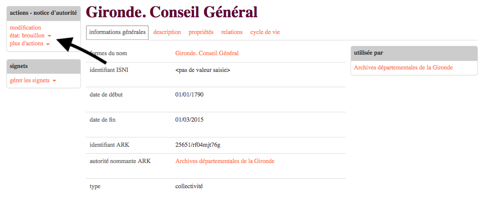
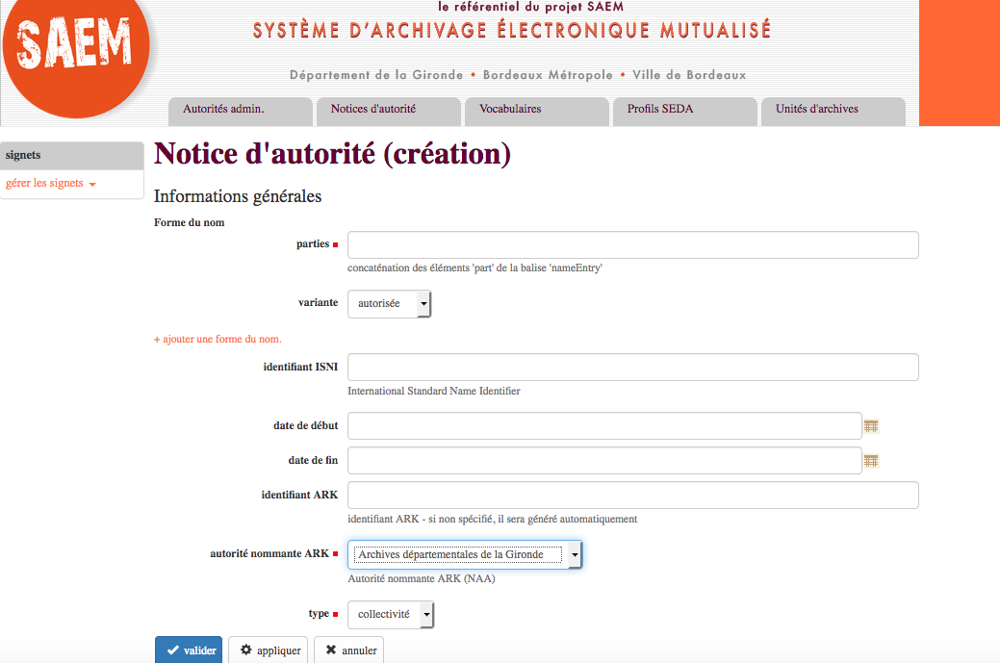
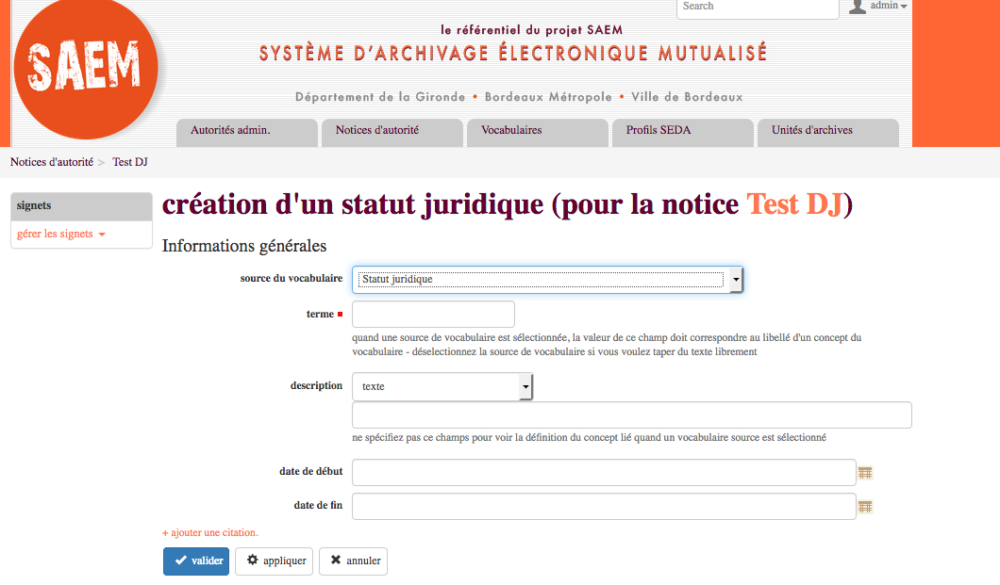
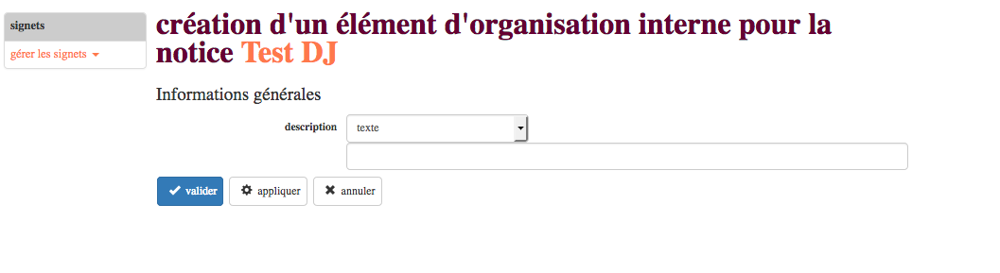

class: inverse, center, middle
background-image: url(./images/continuum.jpg)
background-position: top;
background-repeat: no-repeat;
background-size: contain;
.footnote[Ceci est fait en texte avec du logiciel libre]

# Formation Référentiel : notices d'autorité

---

## Objectifs

- comprendre la gestion des données de référence
- comprendre la notion de notices d'autorité
- maîtriser la création de notices

---

## Présentation : 20"

Objectifs : faire un tour de table, ouverture des échanges (pas de mauvaises questions, loi des 2 pieds, détente collective)

- pourquoi nous sommes là ?
- quel est notre objectif commun ?

**Dispositif** :

_-_ Nuage de mots :

Pourquoi des notices producteur ? https://answergarden.ch/778219 

et 

Quelles sont  vos appréhensions face à ce nouvel outil ? https://answergarden.ch/778221

---

## Programme de la formation : 5"

- matinée : concepts et usages
- après-midi : manipulation (les mains dans le cambouis)

---

### Concept : les données de référence de l'archivage

#### Les normes appliquées aux archives : 10"

Des descriptions séparées mais liées permettent :

- De traiter de manière très efficace les relations complexes et multidimensionnelles
- D’améliorer la communication et l’échange d’informations archivistiques
- L’interopérabilité entre les systèmes d’information

> contextualisation : la mise en place du standard RIC montre l'évolution de la pratique archivistique en lien avec l'exposition des archives sur le Web

#### **L'indexation**

---

### Présentation du référentiel : 30"

##### 1. Objectif d'un référentiel de données : 10"

**RAPPEL** :

La mise à disposition de « _données de référence_ » constitue depuis de la loi « Lemaire » sur la République numérique du 7 octobre 2016, « _une mission de service public relevant de l'État_ » (article 14).

Toutes les administrations sont censées participer à ce « service public de la donnée » : ministères, collectivités territoriales, opérateurs publics, etc.

---

**Un outil « #DataQuality »**

**Objectif** : Un référentiel de structuration et de gestion des métadonnées, interopérable, développé en open source, prenant en compte le contexte normatif et basé sur une ontologie.

> Ontologie : décrit un champ de connaissances ou répond à des objectifs particuliers (modéliser les objets et leurs parties)

---

Un référentiel de structuration et de gestion des métadonnées, interopérable pour **créer, importer, centraliser, gérer et exposer** :

- des vocabulaires contrôlés publics ou internes
- des notices d’autorité des acteurs de l’archivage
- des autorités et unités administratives
- des profils d’archivage conformes au SEDA (toutes versions)

---

#### 2. Les entités dans le référentiel

##### les vocabulaires contôlés 5"

Les vocabulaires sont des **listes de termes** organisées. Ils peuvent prendre la forme de listes simples (listes d’autorité) ou hiérarchiques (thésaurus).

Dans le référentiel, il est possible de créer des vocabulaires mais également d’en importer.

---

#### 2. Les entités dans le référentiel

###### les producteurs 5"

Les notices d’autorités sont des **fiches de description des producteurs** d’archives, conformément à la norme [ISAAR-CPF](https://fr.wikipedia.org/wiki/Norme_internationale_sur_les_notices_d%27autorit%C3%A9_archivistiques_relatives_aux_collectivit%C3%A9s,_aux_personnes_et_aux_familles). Le référentiel implémente le schéma [EAC-CPF](http://eac.staatsbibliothek-berlin.de/) et permet ainsi d’importer, de créer et d’exporter des notices d’autorités dans un **format intéropérable** (XML) avec d’autres applications.

Dans le référentiel, chaque notice d’autorité présente des informations sur un producteur qui sont classée dans les quatre premiers onglets (informations générales, description, propriétés, relations). Ces onglets correspondent aux zones de la norme ISAAR-CPF. Un cinquième onglet « cycle de vie » correspond à l’enregistrement des évenements effectués sur la notice.

---

#### 2. Les entités dans le référentiel

##### Les autorités administratives 5"

Au sein du référentiel, une **autorité administrative** est une collectivité (commune, département ou un établissement public) « mère », composée de plusieurs **unités administratives** « filles » (directions ou services) et de x **agents** de type personne (employés).

L’autorité administrative n’a pas de rôle archivistique propre ; les rôles sont définis pour les unités. Par contre elle permet de paramétrer le NAAN du système d'identifiant des entités ARK.

> NAAN : Name Assigning Authority Number . L'identifiant d'autorité d'une entité (administrative)

---

#### 2. Les entités dans le référentiel

##### Les profils 5"

Pour préparer des versements automatisés ou réguliers d’archives électroniques, l’étude du flux permet de définir un plan de classement type, ainsi que le contenu attendu et des règles de gestion (DUA, sort final ou communicabilité).

L’ensemble des règles définies constitue un profil SEDA, lui-même composé de plusieurs unités d’archives et d’objets données associés. Dans un premier temps, il convient de créer des unités d’archives qui seront réutilisables dans n’importe quel profil.

---

## PAUSE : 20"

---

### III - Les notices producteurs dans le Référentiel : 85"

#### présentation de la norme ISAAR-CPF : 20"

ISAAR (CPF) Norme internationale sur les notices d'autorité archivistiques relatives aux collectivités, aux personnes et aux familles édition ==> aide à structurer et à mettre en forme les informations sur un producteur

- 27 éléments de description sont regroupés en quatre zones :

1. Zone d’identification
2. Zone de la description
3. Zone des relations
4. Zone du contrôle

---

**ISAAR (CPF) la zone d’identification**

1. Type d’entité
2. Forme(s) autorisée(s) du nom
3. Formes parallèles du nom
4. Formes du nom normalisées selon d’autres conventions
5. Autres formes du nom
6. Numéro d’immatriculation des collectivités

---

**ISAAR (CPF) : la zone de la description**

1. Dates d’existence
2. Histoire
3. Lieux
4. Statut juridique
5. Fonctions et activités
6. Textes de référence
7. Organisation interne/généalogie
8. Contexte général

---

**ISAAR (CPF) : la zone des relations**

1. Nom(s)/numéro d’immatriculation des collectivités, des personnes ou des familles associées
2. Type de relation
3. Description de la relation
4. Dates de la relation

---

**ISAAR (CPF) : la zone du contrôle**

1. Code d’identification de la notice d’autorité
2. Code(s) d’identification du ou des services
3. Règles ou conventions
4. Niveau d’élaboration
5. Niveau de détail
6. Dates de création, de révision ou de destruction
7. Langue(s) et écriture(s)
8. Sources
9. Notes relatives à la mise à jour de la notice

**_NB : Pour en savoir plus sur la norme ISAAR-CPF_** : https://www.ica.org/sites/default/files/CBPS_Guidelines_ISAAR_Second-edition_FR.pdf

---

**le schéma EAC-CPF** : La traduction informatique de la norme ISAAR-CPF en langage informatique :

**Les éléments obligatoires à renseigner** :

1. Forme(s) autorisée(s) du nom
2. Type d'entité
3. Dans le Référentiel : l'autorité administrative

---

**Les éléments non obligatoires mais fortement recommandés** :

1. Dates d’existence
2. Lieux
3. Statut juridique
4. Fonctions et activités
5. Textes de référence
6. Zone des relations

---

##### lien entre les entités du référentiel : 10"

1. lien avec les vocabulaires : 2"

De nombreux champs des notices producteurs pourront être remplis grâce à des vocabulaires contrôlés pour :

- être conformes au schéma XML-EAC

- faciliter la saisie

- éviter les erreurs

---

Le champs à reconnaitre :

## 

On choisi son vocabulaire

## 

Puis on cherche le terme adéquat : autocomplétion

---

Les informations contenus dans le vocabulaire sont embarquées dans la notice d'autorité

---

2. lien avec les autorités administratives : 2"

   Permet de relier une autorité administrative à une notice d'autorité

---
3. lien avec les profils SEDA : 1"

Lier un service producteur à une unité d'archives d'un profil SEDA

---

4. lien avec les outils de gestion des archives papier et électroniques : 5"

  

A retenir : 
- Le référentiel : centralisateur des données de référence.
- Les notices "Acteurs" d'Arkhéia seront validées dans le référentiel pour :
  - Eviter les doublons
  - Normaliser les noms
  - Faciliter à terme les liens entre les versements "papier" et "électroniques

---

5. workflow de publication

- Attribuer le statut "publier" à une notice producteur

  Par défaut le statut de la notice est "brouillon"

  

- Commentaire sur le changement de statut

- Le statut est modifié

---

##### Présentation de l'interface de saisie en détails : 45"

---

## Main dans le cambouis

### Créer une notice

#### Saisie de la zone information générale

---

#### Saisie de la zone description

Zoom sur les menus de la zone description

---

**Exercice** :

- Renseigner la zone description

---

- **Ajouter un lieu**
  Chapitre 5.2.3 d'ISAAR-CPF : Lieux

**Objectif** :

Indiquer les principaux lieux et/où ressorts juridictionnels d’origine, de vie ou de résidence de la collectivité, de la personne ou de la famille, ou ceux avec lesquels l’entité a eu d’autres liens.

**Règle**:

Enregistrer, pour chacun des principaux lieux/ressorts juridictionnels, son nom, la nature de son lien avec l’entité et la période concernée.

---

- **Ajouter une fonction**

Chapitre 5.2.5 d'ISAAR-CPF : Fonctions et activités
**Objectif**:
Indiquer les fonctions et les activités (professionnelles ou privées) de la collectivité, de la personne ou de la famille.

**Règle**:
Enregistrer les fonctions et les activités (professionnelles ou privées) de l’entité décrite, ainsi que les dates correspondantes lorsque nécessaire. Le cas échéant, décrire la nature de la fonction ou de l’activité.

Contient les informations sur les activités de l'entité décrite.

---

- **Ajouter un statut juridique**
  Chapitre 5.2.4 d'ISAAR-CPF : Statut juridique
  **Objectif**:
  Indiquer le statut juridique d’une collectivité.

**Règle**:

Enregistrer le statut juridique et, s’il y a lieu, la nature de la collectivité, ainsi que les dates de validité de ce statut.

> NB : un vocabulaire contrôlé des différents statuts juridiques sera à la disposition des utilisateurs

- **Ajouter un texte de référence**

Chapitre 5.2.6 d'ISAAR-CPF : Textes de référence

**Objectif**:
Indiquer l’origine des attributions de la collectivité, de la personne ou de la famille, qu’il s’agisse de ses pouvoirs, de ses fonctions, de ses responsabilités, ou de son champ d’activité (y compris géographique).

**Règle**:

Enregistrer tout texte de référence (loi, décret, arrêté, directive, recommandation, délibération, décision, etc.) qui est à l’origine des pouvoirs, des fonctions, des responsabilités de l’entité, ainsi que les informations sur les juridictions compétentes et les dates d’exercice ou de modification de ses attributions.

---

- **Ajouter un contexte général**

Chapitre 5.2.8 d'ISAAR-CPF: Contexte général

**Objectif** :

Fournir une information significative sur le contexte général, social, culturel, économique, politique, historique, etc., dans lequel la collectivité, la personne ou la famille a vécu ou a exercé son activité.

**Règle** :

Enregistrer toutes les informations significatives sur le contexte social, culturel, économique, politique, historique, etc., dans lequel l’entité a exercé son activité.

---

- **Ajouter une profession ou une activité**

Chapitre 5.2.5 d'ISAAR-CPF : Fonctions et activités

**Objectif**:

Indiquer les fonctions et les activités (professionnelles ou privées) de la collectivité, de la personne ou de la famille.

**Règle**:

Enregistrer les fonctions et les activités (professionnelles ou privées) de l’entité décrite, ainsi que les dates correspondantes lorsque nécessaire. Le cas échéant, décrire la nature de la fonction ou de l’activité.
Contient les informations sur les activités de l'entité décrite.

---

- **Ajouter l'élément Organisation interne/généalogie**

Chapitre 5.2.7 d'ISAAR-CPF Organisation interne/généalogie

**Objectif** : Présenter l’organisation interne d’une collectivité, ou la généalogie d’une famille.

**Règles**:

Pour une collectivité, décrire la structure interne, et préciser les dates des modifications dont la connaissance est nécessaire à la compréhension du fonctionnement de la collectivité (par exemple à l’aide d’organigrammes).  
Pour une famille, décrire la généalogie (par exemple à l’aide d’un arbre généalogique) de manière à indiquer les relations entre ses membres avec leurs dates.

---

- **Ajouter l'élément d'information historique**

Chapitre 5.2.7 d'ISAAR-CPF : Histoire

**Objectif**:

Donner un résumé de l’histoire de la collectivité, de la personne ou de la famille.

**Règle**:

Enregistrer, sous la forme d’un texte rédigé ou d’une chronologie, les principaux événements de l’existence de l’entité décrite, ses activités, ses réalisations. Cela peut comprendre des informations sur le genre, la nationalité, la famille, et les appartenances religieuses ou politiques. Chaque fois que cela est possible, introduire ici des dates comme élément constitutif de la narration

---

#### Renseigner la zone "propriété"

La zone propriété du référentiel correspond :

- **à la zone 5.4.8 d'ISAAR-CPF** : Sources

et

- **à la zone 6 d'ISAAR-CPF** : RELATIONS ENTRE LES COLLECTIVITÉS, LES PERSONNES ET LES FAMILLES, ET DES RESSOURCES ARCHIVISTIQUES OU AUTRES

---

##### Sources

Chapitre 5.4.8 d'ISAAR-CPF : Sources

**Objectif**:

Identifier les sources consultées pour l’élaboration de la notice d’autorité.

**Règle**:

Enregistrer ici les sources consultées pour l’élaboration de la notice d’autorité.

---

##### Ressources liées

Les notices d’autorité pour les archives sont créées en premier lieu pour donner des informations sur le contexte de production des documents d’archives.

Pour que ces informations soient utiles, il est nécessaire de relier les notices d’autorité à la description des documents Mais les notices d’autorité pour les archives peuvent également être reliées à des informations sur toute autre ressource intéressante. Lorsque de tels liens sont établis, il est important de décrire la nature de la relation – lorsqu’on la connaît – entre la collectivité, la personne ou la famille, et la ressource associée.

---

- Chapitre 6.3 d'ISAAR-CPF : Nature des relations entre l'agent et la ressource

**Objectif** :

Identifier la nature des relations entre la collectivité, la personne ou la famille et les ressources associées.

**Règle** :

Décrire la nature des relations entre la collectivité, la personne ou la famille et les ressources associées, à savoir : producteur, auteur, sujet, détenteur, dépositaire, propriétaire des droits d’auteur, propriétaire...

---

- Chapitre 6.2 d'ISAAR-CPF : Nature des ressources associées

**Objectif** :

Identifier la nature de la (des) ressource(s) associée(s) référencée(s).

**Règle** :

Préciser la nature des ressources associées : ensemble archivistique (fonds, série organique, etc.), description archivistique, instrument de recherche, monographie, article de périodique, site web, photographie, collection conservée muséale, film documentaire, archives orales...

---

#### Renseigner la zone relation

La zone Relation correspond au chapitre 5.3 d'ISAAR-CPF : ZONE DES RELATIONS

L’objectif de cette zone est de décrire les relations avec d’autres collectivités, personnes ou familles, susceptibles d’être décrites dans d’autres notices d’autorité.

Dans ISAAR-CPF (chapitre 5.4.3) plusieurs relations sont définies : Elles permettent d'identifier la nature générale de la relation entre l’entité décrite et une collectivité, une personne ou une famille.

---

**Le Référentiel permet de typer 3 des 4 relations prévues par la norme :**

##### Relation chronologique

Dans une relation chronologique, l’entité peut succéder à plusieurs collectivités, personnes ou familles pour exercer certaines activités. Inversement, plusieurs collectivités, personnes ou familles peuvent succéder à une seule entité.

- Exercice 1 : créer une relation chornologique où l'entité est le successeur d'une autre entité

---

**Relation chronologique**

- Exercice 2 : créer une relation chornologique où l'entité est le prédécesseur d'une autre entité

---

##### Relation hiérarchique

Dans une relation hiérarchique, l’entité peut exercer une autorité et contrôler les activités de plusieurs collectivités, personnes ou familles. L’entité peut également être subordonné à plusieurs collectivités, personnes ou familles.

> [par exemple : supérieur/subordonné ; contrôleur/contrôlé ; propriétaire de / appartient à ; parent/enfant ]

- Exercice 1 : créer une relation hiérarchique où l'entité est le subordonné (enfant) d'une autre entité

---

##### **Relation hiérarchique**

- Exercice 2 : créer une relation hiérarchique où l'entité est le supérieur (parent) d'une autre entité

---

##### Relation d’association

Cette expression générale désigne tout type de relation autre que ceux mentionnés ci-dessus (par exemple : client/fournisseur, membre, partie de/constitué par, partenaire professionnel, service administratif en relation avec un autre...)

---

#### Zone de Contrôle

La zone de contrôle telle qu'entendue par la norme ISAAR-CPF n'est pas vraiment intégrée au référentiel mais :

Certains éléments sont renseignés automatiquement grâce à la zone **<u>Cycle de vie</u>** et à **<u>l'état de publication</u>** de la notice. 

#### Exporter en EAC

**Exporter**

---

**Enregistrer la notice**

**La notice se trouve dans téléchargement**

Le nom se forme automatiquement à partir de l'identifiant ARK

---

**Exemple d'export EAC**

---

#### Conclusion

Vous n'êtes pas tout seul...

Le portrait

Quels sentiments après cette journée de formation ?

https://answergarden.ch/778227