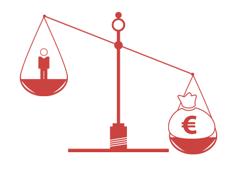
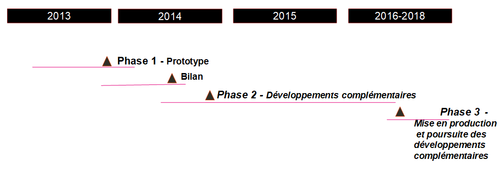
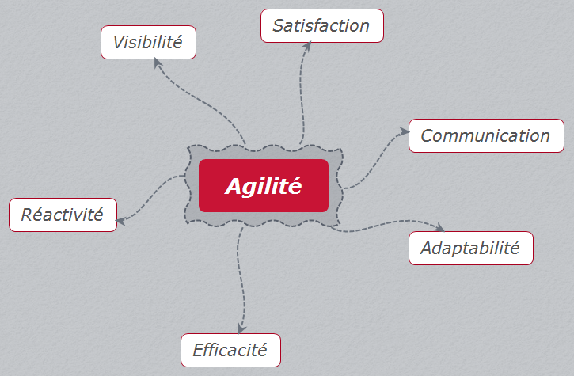
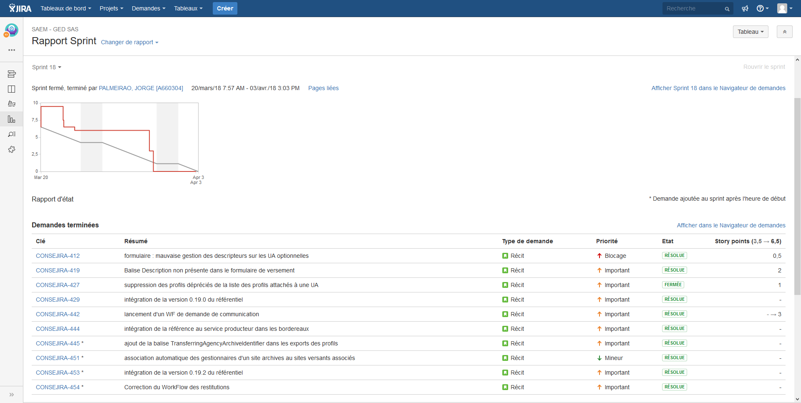
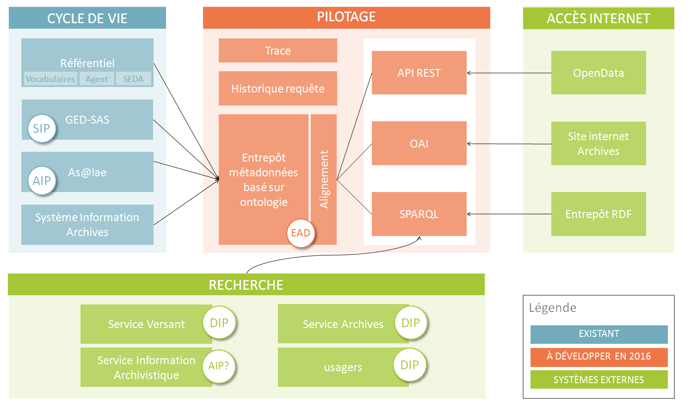
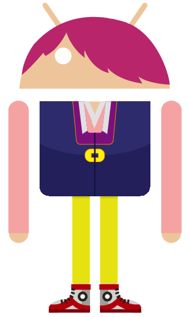

class: inverse, center, middle

.footnote[Ceci est fait en texte avec du logiciel libre]

# Webconf CDG 13
## 9 octobre 2018

---

### Au programme

1. Genèse du projet
2. Développement d'un produit open source,
3. Projet mutualisé et transversal,
4. L'équipe projet

<!-- 
le projet est-il né d’une volonté « politique » par le haut ou du fait de techniciens dans les services ?
-->

---
#### Tout ce que vous avez toujours voulu savoir sur le projet Girondin

---
#### Chronologie
* **2010** : Initiative du Conseil général de la Gironde recherche de partenaires
* **2011** : Réunions avec les grosses collectivités aquitaines, puis rencontres bilatérales entre DGS et lancement du projet piloté par le Conseil général.

* La première priorité : définir le **cadre du partenariat** et les modalités d’**achat commun** de prestations. 

.reduite[]
---
#### Objectifs
* Mettre en place un **partenariat exemplaire** entre les membres fondateurs afin de mutualiser les expériences des partenaires et favoriser la **montée en compétences de chacun**,
* Optimiser et **partager les coûts** d’investissement des collectivités sur le prototypage d’un SAE,
* Construire ensemble une **offre** d’archivage électronique de confiance qui pourra être **ouverte** à d’autres utilisateurs autour des membres fondateurs.

---
#### Orientations partagées
* Utiliser des **solutions libres**
* **Reverser** les développements en open source
* Faire émerger un ensemble de **bonnes pratiques** basé sur le contexte normalisé (OAIS, SEDA, etc.)
* Permettre que le SAE puisse **recevoir** une grande variété d’archives
* Mettre en œuvre une **gouvernance des risques** conformément au RGS

---

#### Les phases du projet
Découpage du projet en trois étapes
* phase 1 – **Étude et prototypage** à partir du socle Alfresco As@lae
* phase 2 – **Développements** complémentaires et construction du référentiel, **études** complémentaires
* phase 3 – **Exploitation puis offre de service** du système d’archivage électronique.

---
#### Outillage projet

* **Espace collaboratif** sur Alfresco pour le partage des documents et du planning mis à disposition par la métropole
* **tableau** (Kanban) de suivi des développements (cubicweb avec Logilab, Jira avec Atos)
* **Pad** prise de notes partagé (framapad), **dépôt de source** et gestion de la **documentation en ligne** (gitlab/readthedocs)

.reduite[]
---
#### Réalisations et périmètre fonctionnel
* Des besoins fonctionnels à géométrie variable
* pas de solution disponible sur étagère

---
#### Réalisations et périmètre fonctionnel

---
#### Méthode agile pour le développement
.pull-left[
.reduite[]
]
.pull-right[
.reduite[]
]

* Les individus et leurs interactions, de préférence aux processus et aux outils,
* Des solutions opérationnelles, de préférence à une documentation exhaustive,
* La collaboration avec les clients, de préférence aux négociations contractuelles,
* La réponse au changement, de préférence au respect d’un plan.

> Précisément, même si les éléments à droite ont de la valeur, nous reconnaissons davantage de valeur dans les éléments à gauche.
---
#### L'expression des besoins...et leur priorisation
Rédactions en commun de users stories (US) : « en tant que (rôle).. je veux (fonctionnalité métier)… afin de (objectif)… » + critères d’acceptation pour tests

.reduite[]

---
#### Le référentiel des besoins...en mouvement
* Alimentation du backlog par le Product Owner [JIRA](https://mtpl.bs.fr.atos.net/jira/)
* réunion de priorisation avec le COPROJ
* réunion de planification avec le(s) prestataire(s) : identification des tâches de développement et estimation de la charge
* sprint de développement : 2 semaines du lundi au vendredi, présentation du résultat au COPROJ ou COTECH (démo) et rétrospective (amélioration continue)

.reduite[]

---
#### Réalisation par phase : définition de la vision produit

---
#### Réalisations phase 2
* Marché référentiel – Réalisation d’un **référentiel de structuration et de gestion** des métadonnées, développé en open source, réutilisant les normes métiers au sein d'une ontologie

* Périmètre : créer, importer, centraliser, gérer et exposer
  * des **vocabulaires** contrôlés publics ou internes
  * des **notices** d’autorité des acteurs de l’archivage
  * des **profils** d’archivage conformes au SEDA (toutes versions)

* Choix du prestataire : Société Logilab
  * Montant du marché : Mapa (env. 200 000 €)
  * Lancement du marché : octobre 2014
---

#### Réalisation et bilan phase 2
.pull-left[
* Phase 2 : développements
  * **conception** d’une ontologie SAEM
  * **conception et réalisation** d’un outil de gestion des référentiels de données pour l’archivage (vocabulaires, acteurs, profils)
  * **développements de connecteurs** entre les modules (OAI-PMH)
  * poursuite des développement du module Alfresco et des web services as@lae
  * **rédaction** d’une convention d’exploitation (phase 3)
]
.pull-right[
* Coûts du SAE:
  * **225k€ par partenaire** soit 675k€
  * 345 j de développement
  * 3j/sem pendant 3 ans de charge interne
Audit de conformité (grille SIAF, NF42-013, OAIS) :
* 80% des exigences couvertes
]

.reduite[]
---
#### Ontologie saem

---
#### Le référentiel Girondin
.reduite[]
---
#### Le référentiel Girondin
**Autorités administratives** : possibilité de créer des collectivités et leurs entités (basée sur l’ontologie Organization)

.reduite[]
---
#### Le référentiel Girondin
**Notices d’autorité** : possibilité de créer ou d’importer des notices d’autorité en XML EAC et de les associer à une autorité ou une unité administrative

.reduite[]
---
#### Le référentiel Girondin
**Vocabulaires** : possibilité d’importer des vocabulaires (thésaurus et listes d’autorité SIAF) et d’en créer pour les besoins des métiers de chaque collectivité (ex : liste des lieux ou bâtiments)
.reduite[]
---
#### Le référentiel Girondin
**Profils SEDA** et unités d’archives: création de profils et possibilité d’export et inspiration de la V2 du SEDA pour concevoir des unités d’archives réutilisables pour constituer des profils

.reduite[]
---
#### Partage d'expériences : travailler en réseau
Assurer la **cohérence et la complémentarité** du projet SAEM avec d'autres projets en cours

* échanges avec l’équipe VITAM (prototype d'accostage à venir)
* **participation** au groupe de travail pré-versement SIAF
* participation au groupe de travail SEDA V2
* **implication** dans la feuille de route d'As@lae
* Alimentation du blog SAEM
* **Collaboration** avec le SIAF pour le développement d’un outil de conception de profil SEDA v2 à partir du référentiel SAEM (SHERPA)
---
#### Retours d'expériences
* **Complexité et technicité** du sujet archivage électronique (montée en compétence continue)
* **Arbitrages** en mode mutualisé (convergences des visions)
* **Evolutions** du paysage institutionnel (mutualisation)
* **Multiplicité des prestataires** qui complexifie la synchronisation des briques applicatives
* **Charges humaines et durée du projet** (renouvellement des équipes et pilotage à long terme, allongement des délais en raison d’un processus de décision freiné par la multiplicité de acteurs)
* **Méthodologie du projet**  : une  adaptation permanente (méthode Agile , outils de suivi de projet)
* **Documentation** du projet : une élaboration continue (cr coproj, études, schéma manuels utilisateurs) et un travail à part entière

---
#### Equipe projet : complémentarité et complicité
.pull-left[

]
.pull-right[
**Delphine Jamet** : experte en archives numériques
* rétroconversion EAD
* mise en ligne fonds numériques
* classement et versement
* XML fluent - RDF aware
* Product owner : référentiel
]
---
#### Equipe projet : complémentarité et complicité
.pull-left[

]
.pull-right[
**Pascal Romain** : facilitateur produit
* attaché de conservation et ingénieur
* bricoleur numérique
* Product owner et interface
* chargé d'ouverture de données
]
---
### Démo
[espace démo](http://saem-demo.cloudapp.net)

