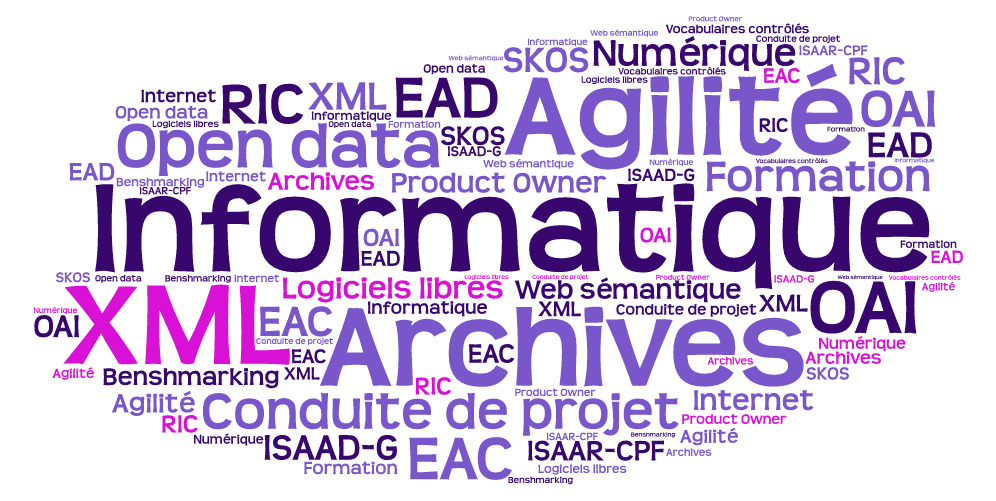
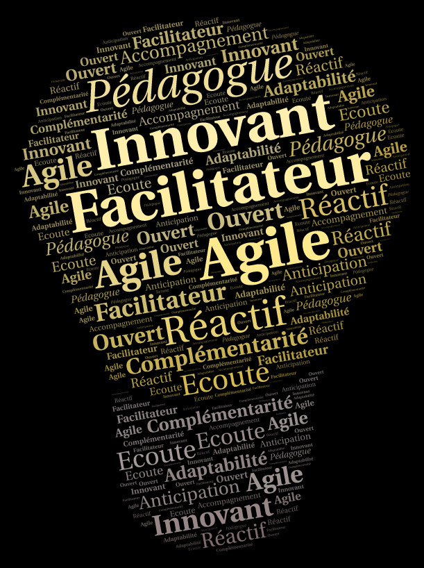

# Réponse type à une demande d'assistance à maîtrise d'ouvrage dans le cadre d'une refonte de site internet

## Qui sommes nous ?

### Des consultants pas comme les autres ...

Imprégnés des valeurs du service public, nous souhaitons oeuvrer en faveur du **développement du bien commun**, notamment au travers de l'utilisation de **logiciels libres** et par la mise à disposition d'une documentation sous **licence libre**.

Nous ne souhaitons pas nous positionner comme experts mais plutôt comme **facilitateur.trice** ou accompagnateur.trice en privilégiant les valeurs d'écoute, de respect et de transparence.

Venant du monde des collectivités territoriales, nous avons décidé de nous lancer dans celui de l'assistance à maîtrise d'ouvrage afin d'accompagner au mieux les collectivités territoriales dans leurs besoins.

Nos champs de compétences tournent autour de la données. Nous pouvons donc vous accompagner dans de nombreux domaines que cela soit la mise en place d'un projet d'archivage électronique, d'un portail documentaire ou d'un portail open data et ou les 3 en même temps !

### Nos compétences

### Nos atouts 

Au travers de notre expérience du fonctionnement des administrations publiques et de la conduite de projets d'élaboration et de mise en oeuvre d'outils de diffusion des données archivistiques nous proposons un accompagnement aussi bien en terme d'organisation qu'en terme de solutions techniques.

La condition préalable à la réussite de ce genre de projet est la convergence des intérêts entre la directions chargée des données à diffuser (la direction des archives) et celle chargée du rôle d'opérateur, en général la direction des systèmes d'information.

Pour construire cette convergence nous proposons d'accompagner ces parties prenantes dans l'identification de leurs intérêts à court, moyen et long terme en itérant sur la vision commune à construire et sur les moyens nécessaires pour y parvenir.

Pour mener de façon efficace et conforme aux textes un projet de dématérialisation de processus
documentaire il est indispensable de l’aborder de façon pluridisciplinaire :

- Dimension fonctionnelle (métier) et organisationnelle.
- Dimension technique numérique.
- Dimension juridique, réglementaire et normative.
- Dimension patrimoniale.

L’approche méthodologique liée aux spécificités d’un projet de diffusion des données archivistiques croise : 

- une approche processus : analyse à partir des activités de la direction des Archives et de la direction des services informatiques qui produisent et gèrent  des documents (ou des échanges d’informations), compte tenu de leurs missions dans leur établissement.
> Notre méthodologie : l'event storming

- une approche réglementaire : cartographie des normes et réglements en vigueur en prenant en compte leur hiérarchie et leur usitabilité dans l'institution.
> Notre méthodologie : le mind mapping

- Une approche cartographique de l'outillage logiciel dans le domaine de l'élaboration et de la diffusion des données archivistiques du service d'Archives.
> Notre méthodologie : cartographie des projets mis en oeuvre dans des contextes similaires

A partir de ces éléments nous établissons avec vous un canvas en nous inspirant de la culture lean afin d'identifier les éléments qui comportent le plus de valeurs d'usages, qu'il soient techniques, réglementaires ou fonctionnels. Cette première identification de la valeur maximale d'usage permet de construire un objectif commun et d'identifier la manière dont chacun pourra contribuer à sa réalisation.

En parallèle des ateliers d'expression du besoin permettent de construire un référentiel commun d'attentes et de commencer à travailler sur leur priorisation et l'identification des moyens nécessaires pour leur mise en oeuvre.

Ces ateliers ont également pour objectif de partager un vocabulaire et de mieux comprendre les attentes de chaque partie prenante afin d'établir 2 ou 3 scenarii d'évolution prenant en compte le contexte, les moyens et les objectifs.

## Points clés de notre offre

Nos compétences :

- une culture forte des missions du service public,
- une maîtrise fine du métier d’archiviste et des contextes réglementaires et normatifs associés,
- une maîtrise des différentes solutions techniques existantes et de leurs couvertures fonctionnelles,
- la pratique de la gestion de projet inspiré des méthodologies de la communauté agile (scrum, kanban, lean canvas),

Et bien entendu, la connaissance du métier du conseil, en particulier pour ce qui est des capacités des consultants à écouter, analyser, formaliser, synthétiser et préconiser de manière pragmatique et efficace les meilleurs scénarios possibles.

## Compréhension des besoins

Compréhension des enjeux et des objectifs stratégiques

La refonte globale du site internet et des outils de diffusion des Archives XXXX a pour objectifs : 

## Contexte

## Déroulement de la prestation

### Benshmarking

### Ateliers d'expression de besoin

Ces ateliers permettent de stimuler la créativité et l'expression tout en identifiant les **contraintes de temps et de budget**  propre au contexte. Le résultat consiste dans un référentiel des  besoins. A l'intérieur de celui-ci, notre valeur ajoutée consiste à **faciliter l'identification de la valeur ajoutée**  apportée par la mise en oeuvre de ces besoins. En aidant à leur  priorisation et en interviewvant les personnes impliquées, il est  possible de formaliser un calendrier de réalisation soutenable et  valorisant.

## Intervenants, rôles et responsabilités

## plan de charge et coûts

